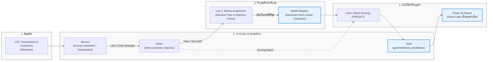

# Microsoft Fabric Data Science — FreshMart Labs


Repository ชุดปฏิบัติการวิทยาศาสตร์ข้อมูลบน Microsoft Fabric ผ่านกรณีศึกษา **FreshMart Customer Churn** (ภารกิจกู้วิกฤตยอดขาย ทำนายลูกค้าที่จะเลิกซื้อ เพื่อส่งแคมเปญรักษาลูกค้าได้ทันเวลา)  
- **กลุ่มเป้าหมาย:** นักวิเคราะห์ข้อมูล (Data Analyst) และผู้สนใจที่ต้องการเข้าใจวงจรงานวิทยาศาสตร์ข้อมูลบน Fabric ครบวงจร  
- **หลักสูตรอ้างอิง:** [Implement a data science and machine learning solution for AI in Microsoft Fabric](https://learn.microsoft.com/training/paths/implement-data-science-machine-learning-fabric/) (พร้อมเนื้อหาสไลด์ภาษาไทยฉบับ Instructor Edition)



## โครงการ (Project)

| รายการ | รายละเอียด |
| --- | --- |
| **License** | [MIT](LICENSE) |
| **Status** | **Active** — พร้อมใช้งานทั้งการเรียนรู้ด้วยตนเองและประกอบการอบรม |
| **Releases** | [Latest release](https://github.com/DataFabric-Academy/ms-fabric-data-science/releases/latest) · [All tags](https://github.com/DataFabric-Academy/ms-fabric-data-science/tags) |
| **Topics** | Microsoft Fabric, MLflow, PySpark, Medallion Architecture, Customer Churn, Power BI Direct Lake |

| เริ่มต้นศึกษา | รายละเอียด | ลิงก์ |
| --- | --- | --- |
| **Docs ทฤษฎีและแนวคิด** | ปูพื้นฐานสถาปัตยกรรม Fabric, วงจร Data Science, และเครื่องมือ | [docs/README.md](docs/README.md) |
| **อภิธานศัพท์ (Glossary)** | รวบรวมคำศัพท์เทคนิคพร้อมคำอธิบายภาษาไทยที่เข้าใจง่าย | [docs/glossary.md](docs/glossary.md) |
| **Labs ลงมือปฏิบัติจริง** | คู่มือและ Notebook ตั้งแต่ Lab 0 ถึง Lab 4 | [labs/README.md](labs/README.md) |

> [!NOTE]
> **เส้นทางผู้เรียน:** ศึกษาเอกสารความรู้ใน [docs](docs/README.md) ตามลำดับโมดูล จากนั้นเปิดใช้งาน Fabric Trial ของตนเอง สร้าง workspace (แนะนำชื่อ `labs`) — **โดยไม่ต้องเชิญผู้อื่นเข้า** — แล้ว `git clone` repository นี้เพื่อนำเข้า Notebook ใน `labs/notebooks/` และแนบ Lakehouse `lh_freshmart` ที่สร้างขึ้น

## ตรวจสอบความพร้อมของแล็บ (Local Verification)

สามารถทดสอบ pipeline ทั้งหมดบนเครื่องของคุณได้ทันทีโดยไม่ต้องต่อ Fabric:

```powershell
pip install -r labs/requirements-test.txt
pytest labs/tests -v
python labs/scripts/run_local_pipeline.py
```

เมื่อการทดสอบผ่านเรียบร้อย ให้เริ่มทำตามคู่มือใน `labs/instructions/` บน Microsoft Fabric ได้ทันที

