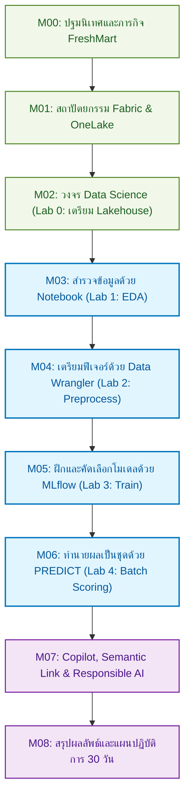

# M00 — ภาพรวมหลักสูตร

เอกสารนี้สรุปจากสไลด์ Instructor Edition ภาษาไทย (M00) และกรอบหลักสูตรบน [Microsoft Learn](https://learn.microsoft.com/training/paths/implement-data-science-machine-learning-fabric/)

หลังอ่านบทนี้ คุณจะเห็นภาพรวมหลักสูตร ทักษะที่คาดหวัง กรณีศึกษา FreshMart และลำดับโมดูลก่อนลงมือแล็บ  
ศัพท์ที่ใช้บ่อยอธิบายไว้ที่ [glossary.md](glossary.md)

## ภารกิจธุรกิจ FreshMart: ทำไมวิทยาศาสตร์ข้อมูลจึงสำคัญ?

ในธุรกิจค้าปลีกสมัยใหม่ การหาลูกค้าใหม่อาจมีต้นทุนสูงกว่าการรักษาลูกค้าเดิมถึง **5 เท่า**! หากลูกค้ารายหนึ่งเริ่มลดความถี่ในการมาซื้อของสดหรือสินค้าเบเกอรี่ นั่นคือสัญญาณเตือนภัยของการเลิกซื้อ (Customer Churn) ที่กำลังจะเกิดขึ้น

ในหลักสูตรนี้ คุณจะรับบทเป็น **Data Science Analyst** ของซูเปอร์มาร์เก็ต FreshMart นำประวัติการซื้อและข้อมูลสมาชิกมาสร้างโมเดล Machine Learning เพื่อ **ชี้เป้าลูกค้าที่เสี่ยงเลิกซื้อล่วงหน้า** และส่งมอบผลลัพธ์ผ่าน OneLake ไปยังแดชบอร์ด Power BI เพื่อให้ฝ่ายการตลาดออกโปรโมชั่นรักษาลูกค้าได้ทันท่วงที

> [!TIP]
> **มุมมองสำหรับ Data Analyst:**  
> หากคุณคุ้นเคยกับการทำรายงานสรุปสิ่งที่เกิดขึ้นแล้วในอดีต (Descriptive Analytics) เช่น "เดือนที่แล้วยอดขายตกไปกี่บาท" หลักสูตรนี้จะพาคุณก้าวไปอีกขั้นสู่ **Predictive Analytics** คือ "ใครมีโอกาสจะหายไปในอนาคต และเราจะป้องกันได้อย่างไร" โดยใช้พลังการประมวลผลของ Microsoft Fabric

## วัตถุประสงค์หลักสูตร

สร้างโซลูชันวิทยาศาสตร์ข้อมูลและการเรียนรู้ของเครื่องบน Microsoft Fabric ครบวงจร: เริ่มจากโจทย์ธุรกิจ เก็บข้อมูลบน OneLake ฝึกโมเดลและติดตามด้วย MLflow จากนั้นสร้างคำทำนายเป็นชุด แล้วส่งผลไป Power BI

### 6 ทักษะหลักที่คุณจะได้รับ

1. **เข้าใจสถาปัตยกรรม Fabric:** อธิบายการทำงานของ OneLake, การแบ่งกลุ่มงาน (Workloads), และการแบ่งชั้นข้อมูล Medallion
2. **สำรวจข้อมูลเชิงลึก (EDA):** ใช้ Fabric Notebook วิเคราะห์สถิติ ค้นหารูปแบบ และป้องกันข้อมูลรั่วไหล (Data Leakage)
3. **เตรียมฟีเจอร์ด้วย Data Wrangler:** แปลงข้อมูลแบบมีหน้าจอแสดงผล แล้วส่งออกเป็นโค้ด Python/PySpark ที่รันซ้ำได้
4. **ฝึกและติดตามโมเดลด้วย MLflow:** บันทึกพารามิเตอร์ วัดค่าเมตริก (เช่น AUC) และลงทะเบียนโมเดลที่ดีที่สุด (Champion Model)
5. **สร้างคำทำนายเป็นชุด (Batch Scoring):** ใช้ฟังก์ชัน PREDICT บน Spark เขียนคะแนนความเสี่ยงลงตาราง Gold (Delta Lake)
6. **ประยุกต์ใช้ AI ยุคใหม่:** เข้าใจการใช้ Copilot, Semantic Link, หลักการ Responsible AI และการบริหารจัดการ Capacity

## แผนที่การเรียนรู้ (Module Roadmap)

### การจับคู่โมดูลกับหลักสูตร Microsoft Learn

| Learn Module | สไลด์ | แล็บในคอร์สนี้ | สิ่งที่ส่งมอบ (Deliverable) |
| --- | --- | --- | --- |
| Introduction to end-to-end analytics | M01 | — | เข้าใจ OneLake และภาพรวมแพลตฟอร์ม |
| Get started with data science | M02 | Lab 0 | สร้าง workspace และเตรียม Lakehouse `lh_freshmart` |
| Explore data with notebooks | M03 | Lab 1 | รายงานวิเคราะห์ของเสียและพฤติกรรมลูกค้า |
| Preprocess with Data Wrangler | M04 | Lab 2 | โค้ดเตรียมฟีเจอร์และตาราง `silver.customer_features` |
| Train and track with MLflow | M05 | Lab 3 | โมเดล Champion `freshmart-churn-model` บน Model Registry |
| Generate batch predictions | M06 | Lab 4 | ตาราง `gold.freshmart_predictions` พร้อมส่งต่อ Power BI |

*M07–M08 เป็นเนื้อหาขยายฉบับ Instructor Edition (Copilot, Semantic Link, และ Roadmap 30 วัน)*  
*หลัง Lab 3 ผู้สอนอาจสาธิต AutoML แบบทางเลือก — ดู [09-automl.md](09-automl.md) และ [คู่มือ Demo](../labs/instructions/instructor-automl-demo.md) ไม่แทนที่โมเดล Champion ของ Lab 3*

## สภาพแวดล้อมที่ต้องมี

| รายการ | ค่าแนะนำ |
| --- | --- |
| Capacity | Fabric Trial ของผู้เรียนแต่ละคน (หรือ F2 ขึ้นไป) — โควตาประมวลผลที่ต้องมีก่อนรัน Spark |
| Workspace | สร้างเองใน Trial ของตนเอง เป็นเจ้าของคนเดียว — **ไม่เชิญผู้เรียนหรือผู้สอนเข้า** |
| ทักษะ | Python / pandas / scikit-learn พื้นฐาน |
| แล็บใน repo นี้ | Workspace ของคุณ (แนะนำชื่อ `labs`), Lakehouse `lh_freshmart` ที่สร้างเอง |

## ระเบียบวิธีเรียนรู้ (จากสไลด์)

- ประมาณ 70% หลักการและสถาปัตยกรรมที่นำไปตัดสินใจได้
- ประมาณ 20% แล็บปฏิบัติ (Lab 0–4)
- ประมาณ 10% สะท้อนโจทย์องค์กรของผู้เรียน

## แนวทางในห้องเรียน

ทำได้ดี:

- ถามทันทีเมื่อแล็บติด
- เชื่อมโจทย์ธุรกิจก่อนเขียนโค้ด
- ทำงานคู่แก้ปัญหาด้วยกัน (แต่ละคนรันบน workspace ของตนเอง — ไม่เชิญใครเข้า)

ควรเลี่ยง:

- ข้ามการสำรวจข้อมูลไปฝึกโมเดลทันที
- คัดลอกโค้ดโดยไม่เข้าใจโครงสร้าง
- เปิดงานอื่นระหว่างสาธิตสด

## ต่อไป

อ่านต่อ: [01 — สถาปัตยกรรม Fabric และ OneLake](01-fabric-architecture.md)
