# M01 — สถาปัตยกรรม Microsoft Fabric และ OneLake

อ้างอิง: Microsoft Learn — [Introduction to end-to-end analytics using Microsoft Fabric](https://learn.microsoft.com/training/modules/introduction-end-analytics-use-microsoft-fabric/) · สไลด์ M01

หลังอ่านบทนี้ คุณจะอธิบายได้ว่าทำไมองค์กรใช้ Fabric และ OneLake แทนการคัดลอกข้อมูลหลายชั้น และชั้น Bronze / Silver / Gold ใช้กับงานวิทยาศาสตร์ข้อมูลอย่างไร  
ศัพท์ที่เกี่ยวข้อง: [Lakehouse](glossary.md#lakehouse) · [OneLake](glossary.md#onelake) · [Medallion](glossary.md#medallion-bronze--silver--gold)

## ทำไมต้องแพลตฟอร์มเดียว

สถาปัตยกรรมข้อมูลแบบเดิมมักเจอ:

- ข้อมูลแยกไซโล — แต่ละทีมคัดลอกข้อมูลคนละสำเนา
- เครื่องมือกระจัดกระจาย — ระบบนำเข้าข้อมูล (Data Ingestion), แหล่งจัดเก็บข้อมูล (Data Lake), คลังข้อมูล (Data Warehouse), ระบบรายงาน BI และระบบโมเดล อยู่คนละแพลตฟอร์ม
- ส่งงานช้า — วิศวกรข้อมูลส่งไฟล์ให้นักวิทยาศาสตร์ข้อมูล แล้วนักวิเคราะห์รอรีเฟรชอีกชั้น

**Microsoft Fabric** เป็นแพลตฟอร์มวิเคราะห์ข้อมูลแบบครบวงจรบนคลาวด์ (SaaS) เก็บข้อมูลศูนย์กลางที่ **OneLake** แล้วให้หลายเครื่องมือประมวลผลอ่าน**สำเนาเดียวกัน**ได้ โดยไม่ต้องคัดลอกซ้ำ ๆ

## องค์ประกอบสำคัญ

### OneLake

- คล้าย “OneDrive สำหรับข้อมูลองค์กร”
- เก็บไฟล์และตารางเปิด (โดยเฉพาะรูปแบบ **Delta Lake**)
- เครื่องมืออย่าง Spark, คำสั่ง SQL แบบ T-SQL และ Power BI อ่านชุดข้อมูลเดียวกันได้

### กลุ่มงาน (workload) ที่เกี่ยวกับวิทยาศาสตร์ข้อมูล

| กลุ่มงาน | บทบาท |
| --- | --- |
| Data Factory | นำเข้าและจัดลำดับงาน (pipeline, Dataflow) |
| Data Engineering | Spark, Lakehouse, notebook ประมวลผลขนาดใหญ่ |
| Data Science | Notebook, การทดลอง, โมเดล, PREDICT, Data Wrangler |
| Data Warehouse | วิเคราะห์ด้วย SQL เชิงสัมพันธ์ |
| Real-Time Intelligence | ข้อมูลสตรีมและการสอบถามแบบใกล้เวลาจริง |
| Power BI | รายงาน และการอ่านตารางตรงจาก OneLake ([Direct Lake](glossary.md#direct-lake)) |

### บทบาททีมบน Workspace เดียวกัน (ภาพองค์กร)

ในองค์กรจริงหลายบทบาทร่วมงานบน workspace เดียวได้ — **ในแล็บคอร์สนี้แต่ละคนใช้ workspace ของตนเอง ไม่เชิญใครเข้า**

| บทบาท | รับผิดชอบหลัก |
| --- | --- |
| วิศวกรข้อมูล (Data Engineer) | Pipeline, คุณภาพข้อมูลชั้น Bronze/Silver, โครงตาราง |
| นักวิทยาศาสตร์ข้อมูล (Data Scientist) | สำรวจข้อมูล, สร้างฟีเจอร์, ทดลองโมเดล, สร้างคำทำนาย |
| นักวิเคราะห์ข้อมูล (Data Analyst) | โมเดลความหมายทางธุรกิจ, รายงาน, ตัวชี้วัดจากตาราง Gold และผลทำนาย |
| สถาปนิก / ผู้ดูแล | Capacity, ธรรมาภิบาล, สิทธิ์ |

## ชั้นข้อมูล Bronze / Silver / Gold สำหรับงานวิทยาศาสตร์ข้อมูล

> [!TIP]
> **เปรียบ Medallion Architecture เพื่อการกำกับดูแลคุณภาพข้อมูล**  
> เพื่อไม่ให้ข้อมูลปนเปื้อน Fabric จัดระเบียบข้อมูลเป็น 3 สัญญาคุณภาพ (Quality Contracts):  
> - 🥉 **Bronze (ข้อมูลต้นฉบับ / Raw Ingestion):** เก็บข้อมูลตามสภาพจริงจากระบบต้นทาง เช่น บันทึกประวัติสแกนบาร์โค้ดที่อาจมีค่าว่างหรือฟอร์แมตวันที่แตกต่างกัน  
> - 🥈 **Silver (ข้อมูลพร้อมวิเคราะห์ / Enriched & Cleansed):** ผ่านการทำความสะอาด ตรวจสอบความถูกต้อง จัดการค่าว่าง และคำนวณฟีเจอร์ (Features) พร้อมป้อนเข้าโมเดล  
> - 🥇 **Gold (ข้อมูลพร้อมใช้ทางธุรกิจ / Business & Curated):** ผลลัพธ์จากการทำนายของโมเดลและข้อมูลรวมระดับธุรกิจ พร้อมให้ผู้บริหารและฝ่ายการตลาดนำไปวิเคราะห์ผ่าน Power BI ได้ทันที

```mermaid
flowchart TD
    subgraph Lakehouse["Lakehouse: lh_freshmart (เปิดใช้งาน Schemas)"]
        subgraph FilesZone["Files (พื้นที่จัดเก็บไฟล์ต้นทาง / Files Layer)"]
            RAW["raw/freshmart_*.csv<br/>(พื้นที่รับไฟล์นำเข้า Landing Zone)"]
        end

        subgraph TablesZone["Tables (ตาราง Delta พร้อมสัญญาคุณภาพ)"]
            subgraph BronzeSchema["schema: bronze (สัญญา: ข้อมูลต้นฉบับ)"]
                BT["transactions (3,000 แถว)"]
                BC["customers (1,500 แถว)"]
            end
            subgraph SilverSchema["schema: silver (สัญญา: ฟีเจอร์พร้อมเทรน)"]
                SF["customer_features<br/>(รวมตาราง, จัดการค่าว่าง, ปรับสเกล)"]
            end
            subgraph GoldSchema["schema: gold (สัญญา: ผลลัพธ์พร้อมใช้)"]
                GP["freshmart_predictions<br/>(200 ลูกค้าใหม่ + ความน่าจะเป็น Churn)"]
            end
        end
    end

    RAW -->|Lab 0: Ingestion & สร้างตาราง| BronzeSchema
    BronzeSchema -->|Lab 2: Data Wrangler & Feature Engineering| SilverSchema
    SilverSchema -->|Lab 4: PREDICT Function| GoldSchema

    classDef fileNode fill:#f1f5f9,stroke:#64748b,stroke-width:1.5px,color:#0f172a;
    classDef bronzeNode fill:#fffbeb,stroke:#d97706,stroke-width:1.5px,color:#78350f;
    classDef silverNode fill:#f0fdf4,stroke:#16a34a,stroke-width:1.5px,color:#14532d;
    classDef goldNode fill:#fef3c7,stroke:#b45309,stroke-width:2px,color:#78350f;
    classDef schemaBox fill:#ffffff,stroke:#2b5797,stroke-width:1.5px,color:#0f172a;

    class RAW fileNode;
    class BT,BC bronzeNode;
    class SF silverNode;
    class GP goldNode;
    class BronzeSchema,SilverSchema,GoldSchema schemaBox;
```

| ชั้น | สัญญาข้อมูล (Contract) | ตัวอย่างใน FreshMart | ใครเขียน / ใครอ่านในแล็บ |
| --- | --- | --- | --- |
| **Bronze** | ข้อมูลต้นฉบับจากระบบต้นทาง ยังไม่ตัดแต่งฟีเจอร์ | `bronze.customers`, `bronze.transactions` | Lab 0 เขียน · Lab 1 อ่าน |
| **Silver** | สะอาด เป็นระเบียบ ล็อกคอลัมน์อินพุต | `silver.customer_features` | Lab 2 เขียน · Lab 3 อ่าน |
| **Gold** | ผลลัพธ์ธุรกิจพร้อมนำไปปฏิบัติการ | `gold.freshmart_predictions` | Lab 4 เขียน · Power BI อ่าน |

หลักการ: โมเดล Machine Learning จะอ่านจาก Silver (ฟีเจอร์ที่สะอาดและนิยามชัดเจน) แล้วเขียนคะแนนกลับไปที่ Gold เพื่อให้ทีมธุรกิจนำไปใช้ — **เราจะไม่ฝึกโมเดลตรงจากไฟล์ต้นทางที่ยังไม่ผ่านการจัดโครงสร้างและตรวจสอบสัญญาข้อมูล**

### ทำไมชื่อ schema ถึงสำคัญอย่างยิ่งใน Fabric?

> [!IMPORTANT]
> **Schema คือสัญญาคุณภาพ (Quality Boundary) ไม่ใช่แค่โฟลเดอร์จัดระเบียบ**  
> ในแล็บ FreshMart เราเปิดใช้งาน **Lakehouse schemas** เพื่อให้ระบบรองรับการอ้างอิงตารางแบบ `schema.table` สองระดับ:  
> - `bronze.transactions` กับ `gold.freshmart_predictions` มีเส้นแบ่งสิทธิ์และความรับผิดชอบชัดเจน  
> - `Files/raw/` เป็นพื้นที่รับไฟล์นำเข้า (Landing Zone) สำหรับไฟล์ CSV จากภายนอก ยังไม่นับเป็นตาราง Bronze จนกว่าจะถูกโหลดเข้าสู่โครงสร้าง Delta ใน schema `bronze`  
> - การเปิดใช้งาน **Lakehouse schemas** ต้องเลือกเปิดตั้งแต่ตอนสร้าง Lakehouse ในขั้นตอนแรกเท่านั้น

ในระดับองค์กร Microsoft แนะนำว่าสามารถแยกเป็น **Lakehouse ต่อชั้น (Bronze LH / Silver LH / Gold LH)** ได้หากต้องการขอบเขตสิทธิ์ที่แยกกันเด็ดขาด แต่สำหรับคอร์สนี้เราใช้โครงสร้าง 1 Lakehouse หลาย schemas เพื่อความสะดวกและประหยัด Capacity  
อ้างอิง: [Understand medallion architecture for Fabric with OneLake](https://learn.microsoft.com/fabric/onelake/onelake-medallion-lakehouse-architecture) · [Lakehouse schemas](https://learn.microsoft.com/fabric/data-engineering/lakehouse-schemas)

## ความเข้าใจผิดที่พบบ่อย

| ความเข้าใจผิด | ความจริง |
| --- | --- |
| Fabric เป็นแค่เปลี่ยนชื่อ Synapse หรือ Power BI | เป็นแพลตฟอร์มรวมกลุ่มงานหลายอย่างบน OneLake |
| ต้องมีคลัสเตอร์ Spark ของตัวเองตลอดเวลา | Spark ถูกจัดการใน Fabric ตาม session หรืองานที่รัน |
| งานวิทยาศาสตร์ข้อมูลต้องย้ายข้อมูลออกไป Azure Machine Learning เสมอ | ฝึก ติดตาม และทำนายเป็นชุดได้ใน Fabric ด้วย MLflow และ PREDICT |
| Lakehouse กับ Warehouse ใช้แทนกันได้ทุกงาน | Lakehouse เหมาะ Spark และการเรียนรู้ของเครื่อง; Warehouse เหมาะงาน SQL เชิงสัมพันธ์เข้มข้น |
| Medallion คือการเติม `bronze_` หน้าชื่อตาราง | ในชุดนี้ชั้นคือ **schema** เช่น `bronze.transactions` — คำนำหน้าแบนไม่ใช่ชั้น |

## คำถามทบทวน

1. ประโยชน์หลักของ Fabric ในโครงการองค์กรคืออะไร — ใช้ตอบจากหัวข้อ “ทำไมต้องแพลตฟอร์มเดียว”  
2. Spark, T-SQL และ Power BI เข้าถึงข้อมูลบน OneLake อย่างไร — คิดถึงแนวอ่านสำเนาเดียว  
3. ถ้าต้องนำเข้าข้อมูลจากระบบ ERP ภายนอกเข้า Lakehouse ควรเริ่มที่กลุ่มงานใด — ดูตาราง workload  
4. ทำไม Lab 0 ต้องเปิด **Lakehouse schemas** ตอนสร้าง — คิดถึงชื่อชั้น Medallion และรูปแบบ `schema.table`  

## เชื่อมแล็บ

- [Lab 0 — ตั้งค่า Lakehouse](../labs/instructions/00-lakehouse-setup.md)

## ต่อไป

อ่านต่อ: [02 — กระบวนการ Data Science](02-data-science-process.md)
