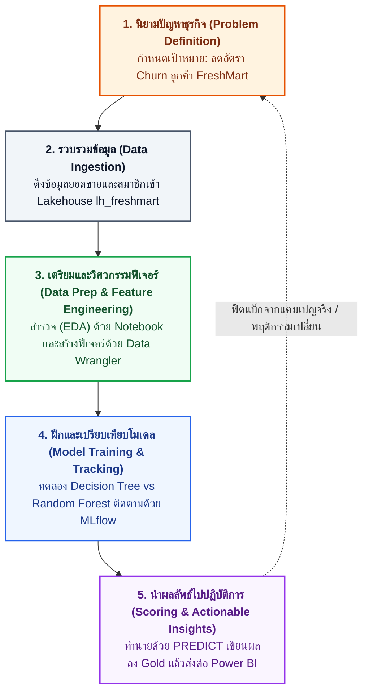

# M02 — กระบวนการ Data Science บน Microsoft Fabric

อ้างอิง: Microsoft Learn — [Get started with data science in Microsoft Fabric](https://learn.microsoft.com/training/modules/get-started-data-science-fabric/) · สไลด์ M02 · [What is Data Science in Fabric?](https://learn.microsoft.com/fabric/data-science/data-science-overview)

หลังอ่านบทนี้ คุณจะเลือกประเภทโมเดลให้ตรงโจทย์ธุรกิจได้ และแมปขั้นตอนวิทยาศาสตร์ข้อมูลเข้ากับอ็อบเจกต์บน Fabric  
ศัพท์ที่เกี่ยวข้อง: [Data Science](glossary.md#data-science) · [MLflow](glossary.md#mlflow) · [Churn](glossary.md#churn)

## วิทยาศาสตร์ข้อมูลในองค์กร: เปลี่ยนข้อมูลเป็นการตัดสินใจที่สร้างกำไร

หัวใจของวิทยาศาสตร์ข้อมูลในธุรกิจ **ไม่ใช่การฝึกโมเดลเพื่อให้ได้คะแนนทางสถิติสูงที่สุดในห้องทดลอง** แต่คือการค้นหาแบบแผนพฤติกรรมลูกค้าที่ซ่อนอยู่ในข้อมูล แล้วแปลงเป็น **การตัดสินใจเชิงรุกที่วัดผลตอบแทนทางธุรกิจได้จริง (Business ROI)**:
- ลดของเสียสินค้าสดและเบเกอรี่หมดอายุ โดยไม่เสียโอกาสขาย
- ชี้เป้าลูกค้าประจำที่กำลังจะเปลี่ยนใจไปซื้อร้านคู่แข่ง ก่อนที่พวกเขาจะเลิกซื้อไปจริง ๆ
- เพิ่มอัตราซื้อซ้ำด้วยข้อเสนอสิทธิประโยชน์ที่ถูกคน ถูกที่ และถูกเวลา

บน Microsoft Fabric คุณสามารถทำกระบวนการทั้งหมดนี้บนข้อมูลที่กำกับดูแลอยู่ใน OneLake โดยไม่ต้องถ่ายโอนข้อมูลข้ามระบบให้ยุ่งยากและเสี่ยงต่อการรั่วไหล

## 4 ประเภทโมเดลหลักในธุรกิจค้าปลีก

| ประเภทโมเดล | คำถามทางธุรกิจ | ตัวอย่างจริงใน FreshMart | การนำไปใช้หน้างาน |
| :--- | :--- | :--- | :--- |
| **จำแนกประเภท (Classification)** | ลูกค้าคนนี้จะอยู่หรือจะไป? | ลูกค้าจะเลิกซื้อ (Churn) ใน 30 วันข้างหน้าหรือไม่? | ส่งคูปองส่วนลดเฉพาะกลุ่มเสี่ยงสูง |
| **ถดถอย (Regression)** | คาดว่าจะเกิดขึ้นเป็นตัวเลขเท่าไร? | ยอดขายสินค้ากลุ่มอาหารพร้อมทานสัปดาห์หน้าจะเป็นกี่บาท? | วางแผนงบประมาณสั่งซื้อ |
| **จัดกลุ่ม (Clustering)** | ลูกค้าแบ่งเป็นกี่สไตล์โดยไม่มีป้ายบอก? | การแบ่งกลุ่มพฤติกรรมลูกค้า (เช่น กลุ่มเน้นของลดราคา vs กลุ่มเน้นสุขภาพ) | ออกแบบแคมเปญการตลาดเฉพาะกลุ่ม |
| **พยากรณ์อนุกรมเวลา (Forecasting)** | ปริมาณความต้องการในอนาคตตามแกนเวลา? | ยอดสั่งซื้อครัวซองต์และขนมปังวันเสาร์-อาทิตย์หน้า | สั่งวัตถุดิบล่วงหน้า ลดของเหลือทิ้ง |

## วงจร 5 ขั้นของ Data Science บน Fabric

กระบวนการวิทยาศาสตร์ข้อมูลเป็น **วงจรวนซ้ำ (Iterative Cycle)** ที่เรียนรู้และปรับปรุงอย่างต่อเนื่อง ไม่ใช่งานแบบเส้นตรงที่ทำครั้งเดียวจบ:

> [!NOTE]
> **วงจรนี้ไม่เคยหยุดนิ่ง:** หากผลการประเมินในขั้นที่ 4 พบว่าโมเดลยังมีคะแนนแยกแยะไม่ดีพอ เราจะวนกลับไปที่ขั้นที่ 3 เพื่อเฟ้นหาฟีเจอร์ใหม่ ๆ หรือกลับไปขั้นที่ 1 เพื่อทบทวนนิยามของ "ลูกค้าเลิกซื้อ" อีกครั้ง

## การจับคู่ขั้นตอนกับอ็อบเจกต์จริงบน Microsoft Fabric

| ขั้นตอนในวงจร | อ็อบเจกต์ / เครื่องมือบน Fabric | ประโยชน์ที่ได้รับ |
| --- | --- | --- |
| **1. ปัญหาธุรกิจ** | Power BI Dashboard, Semantic Model | เห็นช่องว่างของยอดขายและตัวชี้วัดธุรกิจที่ต้องการปรับปรุง |
| **2. จัดเก็บข้อมูล** | Lakehouse (`lh_freshmart`), OneLake Shortcuts | เก็บทั้งไฟล์ดิบและตาราง Delta ไว้ที่ศูนย์กลางเดียว |
| **3. สำรวจ / เตรียมข้อมูล** | Fabric Notebook, Data Wrangler | มีหน้าจอสรุปสถิติและสร้างโค้ด PySpark อัตโนมัติ |
| **4. ทดลองโมเดล** | MLflow Experiment & Runs | บันทึกประวัติการทดลอง เปรียบเทียบ AUC อย่างโปร่งใส |
| **5. ลงทะเบียนโมเดล** | Fabric ML Model (Model Registry) | ควบคุมเวอร์ชัน (Versioning) และพร้อมใช้งานในองค์กร |
| **6. ทำนายเป็นชุด** | ฟังก์ชัน `PREDICT` บน Spark | คำนวณความเสี่ยงของลูกค้านับแสนรายได้รวดเร็ว |
| **7. ส่งมอบคุณค่า** | ตาราง Delta (`gold.freshmart_predictions`), Direct Lake | ผู้บริหารเปิดดูรายชื่อลูกค้าเสี่ยงผ่าน Power BI ได้ทันที |

## Lakehouse กับ Warehouse สำหรับงานวิทยาศาสตร์ข้อมูล

| | Lakehouse | Warehouse |
| --- | --- | --- |
| จุดแข็ง | Spark, ตาราง Delta, notebook, PREDICT | SQL เข้มข้น, ผู้ใช้รายงานพร้อมกันจำนวนมาก |
| รูปแบบข้อมูล | ไฟล์ + ตาราง | ตารางเชิงสัมพันธ์ |
| แนะนำในหลักสูตรนี้ | **ศูนย์กลางหลักของแล็บ FreshMart** | ใช้เมื่อทีมต้องการ SQL serving ชัดเจน |

## Lab 0 (สรุปภารกิจ)

- ลงทะเบียน Fabric Trial ของตนเอง แล้วสร้าง Workspace และ Lakehouse `lh_freshmart` ของตนเอง
- ยืนยันไฟล์ดิบและตาราง Bronze พร้อมใช้
- แนบ Lakehouse เป็นค่าเริ่มต้นของ Notebook

รายละเอียด: [00-lakehouse-setup.md](../labs/instructions/00-lakehouse-setup.md)

## คำถามทบทวน

1. ทำนายงบการตลาดรายเดือนปีหน้าจากประวัติ — ควรใช้ประเภทโมเดลใด (ดูตาราง 4 ประเภท)  
2. ดูคะแนนเปรียบเทียบการรันที่บันทึกด้วย MLflow ใน Fabric — เปิดอ็อบเจกต์ประเภทใด  
3. สำรวจค่าว่างและแปลงฟีเจอร์แบบมีหน้าจอใน Notebook — ใช้เครื่องมือใด  

## ต่อไป

อ่านต่อ: [03 — สำรวจข้อมูลด้วย Notebook](03-explore-data-eda.md)
