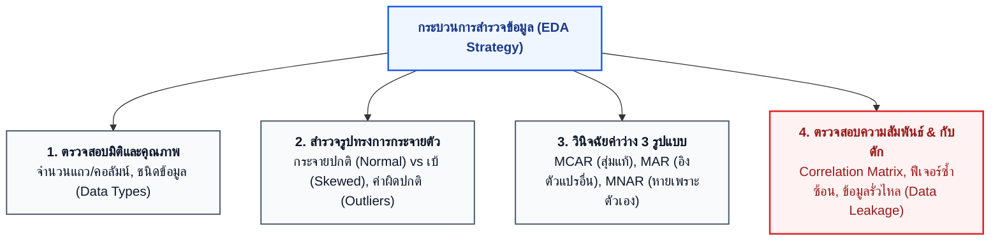

# M03 — สำรวจข้อมูลสำหรับวิทยาศาสตร์ข้อมูลด้วย Fabric Notebook

อ้างอิง: Microsoft Learn — [Explore data for data science with notebooks](https://learn.microsoft.com/training/modules/explore-data-for-data-science-microsoft-fabric/) · สไลด์ M03 · [Tutorial: explore notebook](https://learn.microsoft.com/fabric/data-science/tutorial-data-science-explore-notebook)

หลังอ่านบทนี้ คุณจะรู้ว่าทำไมต้องสำรวจข้อมูลก่อนฝึกโมเดล และใช้ Fabric Notebook ตรวจค่าว่าง การกระจายตัว และความสัมพันธ์ได้อย่างไร  
ศัพท์ที่เกี่ยวข้อง: [การสำรวจข้อมูลเบื้องต้น](glossary.md#การสำรวจข้อมูลเบื้องต้น-exploratory-data-analysis) · [Data leakage](glossary.md#data-leakage-ข้อมูลรั่วไหลเข้าโมเดล)

## ทำไมต้องสำรวจข้อมูลก่อนฝึกโมเดล: ค้นหาความจริงก่อนเสียเวลาเทรน

การสำรวจข้อมูลเบื้องต้น (Exploratory Data Analysis หรือ EDA) เปรียบเหมือน **การตรวจสุขภาพของผู้ป่วยก่อนเริ่มจ่ายยา** หากข้ามขั้นตอนนี้ไปฝึกโมเดลทันที คุณอาจพบว่าโมเดลเรียนรู้จากข้อมูลที่ผิดเพี้ยน หรือเกิดปัญหา "ขยะเข้า ขยะออก" (Garbage In, Garbage Out)



การทำ EDA ช่วยตอบคำถามสำคัญทางธุรกิจ เช่น:
- ลูกค้ากลุ่มที่ Churn มียอดซื้อเฉลี่ยหรือระยะเวลาการเป็นสมาชิกลดลงชัดเจนหรือไม่?
- ข้อมูลอายุของลูกค้าที่หายไป 37 รายการ หายไปแบบสุ่ม หรือเป็นกลุ่มลูกค้าที่ไม่ยอมกรอกข้อมูลตอนสมัคร?

## Fabric Notebooks: ห้องทดลองอเนกประสงค์

### ภาษาบนเอนจิน Spark

| ภาษา | บทบาทในการทำงาน |
| --- | --- |
| **PySpark / Python** | ภาษาหลัก — วิเคราะห์ด้วย pandas, สร้างโมเดลด้วย scikit-learn, พล็อตชาร์ต |
| **Spark SQL** | เขียนคำสั่ง SQL ค้นหาและสรุปผลข้อมูลขนาดใหญ่ได้อย่างรวดเร็ว |
| **Scala** | ประมวลผลขั้นสูงสำหรับงานวิศวกรรมข้อมูลบน Spark JVM |
| **R / SparklyR** | สำหรับทีมนักสถิติที่ใช้ R เป็นเครื่องมือหลัก |

### แนวปฏิบัติสำคัญ (Best Practices)

> [!WARNING]
> **ข้อควรระวังเรื่องหน่วยความจำ (Out of Memory):**  
> คำสั่ง `.toPandas()` จะดึงข้อมูลจากคลัสเตอร์ Spark ทั้งหมดเข้ามาเก็บในหน่วยความจำของ Driver Node เพียงเครื่องเดียว หากข้อมูลมีขนาดหลายสิบล้านแถว อาจทำให้ Spark Kernel แครชได้ สำหรับตารางขนาดใหญ่ควรใช้ `.sample()` หรือสรุปกลุ่มข้อมูลด้วย Spark DataFrame ก่อนแปลงเป็น pandas

1. **แนบ Default Lakehouse** เสมอ เพื่อให้เรียกชื่อตาราง `bronze.customers` ได้โดยตรง
2. **แยกเซลล์ตามหน้าที่:** แบ่งเป็นเซลล์โหลดข้อมูล $\to$ เซลล์สำรวจ $\to$ เซลล์แปลงค่า เพื่อให้ย้อนกลับมาแก้ไขได้ง่าย
3. **ใช้คำสั่ง `display(df)`:** ช่วยให้แสดงผลตารางสวยงาม มีกราฟในตัว และกรองข้อมูลเบื้องต้นได้ทันที

## ค่าว่าง 3 รูปแบบ (Missing Data Mechanisms)

| รูปแบบ | ความหมาย | ตัวอย่างใน FreshMart | แนวทางรับมือ |
| --- | --- | --- | --- |
| **MCAR** (Completely at Random) | สูญหายอย่างสุ่มแท้จริง ไม่ขึ้นกับตัวแปรใด | พนักงานแคชเชียร์ลืมกดบันทึกแบบไม่เจาะจง | ลบแถวทิ้ง หรือเติมด้วยค่ามัธยฐาน/ค่าเฉลี่ยได้ |
| **MAR** (At Random) | สูญหายโดยสัมพันธ์กับตัวแปรอื่นที่วัดได้ | ลูกค้าที่สมัครผ่านเว็บมักไม่กรอกเบอร์โทร | เติมค่าโดยคำนวณแยกตามกลุ่มช่องทางการสมัคร |
| **MNAR** (Not at Random) | สูญหายเพราะตัวค่านั้นเอง | ลูกค้าที่มีรายได้สูงมากไม่ยอมเปิดเผยข้อมูลรายได้ | ระวังอคติ; ควรสร้างคอลัมน์ใหม่ระบุ `is_income_missing` |

## กับดักข้อมูลรั่วไหล (Data Leakage Trap)

> [!CAUTION]
> **กับดักที่ทำลายโมเดลเงียบที่สุด: ข้อมูลรั่วไหล (Data Leakage)**  
> หมายถึง การที่โมเดลแอบ "เห็นข้อสอบล่วงหน้า" ในตอนฝึก โดยนำตัวแปรที่มีข้อมูลของเหตุการณ์ในอนาคตมาร่วมทำนาย เช่น:  
> - ในโจทย์ Customer Churn: หากใส่คอลัมน์ `cancellation_date` หรือ `complaint_resolved` ที่เกิดขึ้น *หลัง* จากลูกค้าตัดสินใจเลิกซื้อแล้ว โมเดลจะได้คะแนน AUC สูงถึง 99% ในแล็บ แต่เมื่อนำไปใช้จริงหน้างานจะทำนายใครไม่ถูกเลย!  
> - **กฎเหล็ก:** ใช้เฉพาะข้อมูลที่ธุรกิจรู้ *ก่อน* ช่วงเวลาที่ต้องการทำนายเท่านั้น!


## การลดมิติด้วย PCA (ภาพรวม)

Principal Component Analysis รวมตัวแปรหลายตัวให้เหลือมิติใหม่ที่รักษาความแปรปรวน — ใช้เมื่อฟีเจอร์หนาแน่นและต้องการสรุปโครงสร้าง ไม่ใช่ทางลัดแทนการเข้าใจความหมายทางธุรกิจของฟีเจอร์

## โครงโค้ดสำรวจมาตรฐาน (แนวคิด)

```python
# 1) อ่านตาราง Delta จาก Lakehouse ผ่าน Spark แล้วแปลงเป็น pandas (ชุดที่ขนาดเหมาะสม)
df = spark.read.table("bronze.customers").toPandas()

# 2) คุณภาพเริ่มต้น
df.shape, df.dtypes, df.isna().mean().sort_values(ascending=False)

# 3) การกระจาย / ความสัมพันธ์ (เช่น ด้วย seaborn)
# sns.histplot(...); sns.heatmap(df.corr(numeric_only=True), ...)
```

## Lab 1

ภารกิจ: โหลดข้อมูล FreshMart, ดูการกระจายยอดขายและ churn, ค่าว่าง, ความสัมพันธ์

- คู่มือ: [01-explore-data.md](../labs/instructions/01-explore-data.md)
- Notebook: `labs/notebooks/01-explore-data.ipynb`

เมื่อรันถูกต้องจากชุดข้อมูลแล็บ คุณควรเห็นธุรกรรมประมาณ 3,000 แถว สมาชิก 1,500 แถว อายุว่าง 37 ค่า และอัตรา churn ประมาณ 19.3%

## คำถามทบทวน

1. Notebook บน Fabric รองรับภาษาใดบน Spark — ดูตารางภาษาด้านบน  
2. การกระจายแบบสม่ำเสมอ (uniform) มีลักษณะอย่างไร — ทุกค่าในช่วงมีความน่าจะเป็นใกล้เคียงกัน  
3. ทำไมต้องแนบ Lakehouse ก่อนสำรวจตาราง — ดูแนวปฏิบัติสำคัญข้อ 1  

## ต่อไป

อ่านต่อ: [04 — Data Wrangler](04-data-wrangler.md)
