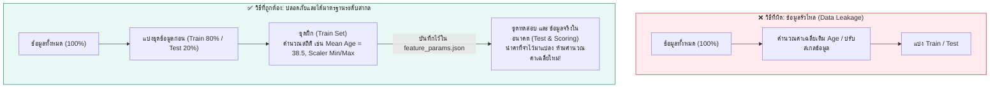

# M04 — เตรียมข้อมูลด้วย Data Wrangler

อ้างอิง: Microsoft Learn — [Preprocess data with Data Wrangler](https://learn.microsoft.com/training/modules/preprocess-data-with-data-wrangler-microsoft-fabric/) · สไลด์ M04 · [Data Wrangler docs](https://learn.microsoft.com/fabric/data-science/data-wrangler)

หลังอ่านบทนี้ คุณจะเปิด Data Wrangler ได้ เลือกวิธีจัดการค่าว่าง และเข้าใจว่าทำไมต้องคำนวณสเกลจากชุดฝึกเท่านั้น  
ศัพท์ที่เกี่ยวข้อง: [Data Wrangler](glossary.md#data-wrangler) · [ฟีเจอร์](glossary.md#ฟีเจอร์-feature) · [feature_params.json](glossary.md#feature_paramsjson)

## ทำไมการเตรียมฟีเจอร์จึงสำคัญที่สุดในงาน Machine Learning

> *"ข้อมูลที่ดีและฟีเจอร์ที่ตรงจุด สำคัญกว่าการสลับอัลกอริทึมซับซ้อนเสมอ"*

การเตรียมฟีเจอร์ (Feature Engineering) คือการนำความรู้ความเข้าใจจากขั้น EDA มาแปลงเป็นตัวแปรที่โมเดลสามารถคำนวณและเข้าใจได้ง่ายขึ้น เช่น การรวมยอดซื้อในอดีตมาเป็นตัวแปร "ความถี่ในการมาซื้อสินค้า" หรือ "ยอดซื้อเฉลี่ยต่อบิล"

> [!TIP]
> **Data Wrangler: Power Query ในโลกของ Data Science**  
> หากคุณคุ้นเคยกับการคลิกแปลงข้อมูลใน Power Query ของ Excel หรือ Power BI เครื่องมือ **Data Wrangler** ใน Fabric Notebook คือคู่หูระดับเดียวกัน! คุณสามารถคลิกลบค่าว่าง จัดกลุ่ม และสเกลข้อมูลผ่านหน้าจอ UI แล้ว Data Wrangler จะ **แปลงการคลิกของคุณเป็นโค้ด Python/PySpark คุณภาพสูงโดยอัตโนมัติ**

## Data Wrangler คืออะไร

เครื่องมือแบบ Interactive ใน Fabric Notebook ที่รวม:
- **Data Grid พร้อม Summary Statistics:** แสดงค่าเฉลี่ย, มิน-แมกซ์, จำนวนค่าว่างแบบไดนามิกทันทีที่คลิกเลือกคอลัมน์
- **กราฟกระจายตัวในตัว:** แสดงฮิสโตแกรมความถี่ของข้อมูลในทุกขั้นตอน
- **คลังคำสั่งการแปลงข้อมูลสำเร็จรูป:** จัดการค่าว่าง, สเกลตัวเลข, One-Hot Encoding
- **โค้ดที่โปร่งใสและนำไปรันซ้ำได้ (Reproducible Code):** ไม่ใช่ระบบกล่องดำ (Black Box) แต่ส่งออกเป็นโค้ด Python/Spark ให้ตรวจสอบและรันใน Pipeline ต่อไปได้

## กฎเหล็กป้องกันข้อมูลรั่วไหลตอนเตรียมข้อมูล (Data Leakage Prevention)

ความผิดพลาดร้ายแรงที่สุดในการเตรียมข้อมูลคือการ **คำนวณสถิติ (เช่น ค่าเฉลี่ย หรือตัวปรับสเกล) จากข้อมูลทั้งหมดก่อนแบ่งชุดข้อมูล**:

> [!IMPORTANT]
> **ทำไมต้องมี `feature_params.json` ในแล็บ FreshMart?**  
> เมื่อเราฝึกโมเดลและนำไปรันทำนายกับข้อมูลลูกค้าใหม่ในอนาคต (Lab 4: 200 รายการ) ลูกค้ากลุ่มใหม่จะไม่มีทางรู้ค่าเฉลี่ยอายุของชุดฝึกในอดีตได้ ดังนั้น เราจึงบันทึกพารามิเตอร์ทั้งหมดไว้ในไฟล์ `feature_params.json` เพื่อให้กระบวนการทำนายในอนาคตใช้สเกลเดียวกับตอนฝึกเสมอ!

## กลยุทธ์จัดการค่าว่าง

| กลยุทธ์ | เมื่อใดที่ควรใช้ | ตัวอย่างใน FreshMart |
| --- | --- | --- |
| **คงไว้ / ไม่สนใจ** | สูญหายน้อยมาก และอัลกอริทึมรองรับได้ (เช่น LightGBM/XGBoost) | คอลัมน์ที่ไม่ส่งผลต่อโมเดล |
| **ลบแถว (Drop Rows)** | ข้อมูลเสียหาย หรือหายเพียงไม่กี่แถวและเป็น MCAR | ลูกค้าที่ไม่มี ID หรือข้อมูลขาดหายทั้งแถว |
| **ลบคอลัมน์ (Drop Column)** | ข้อมูลสูญหายมากกว่า 50–70% จนไม่เหลือสารสนเทศ | ข้อมูลฟิลด์ทางเลือกที่คนแทบไม่เคยกรอก |
| **เติมค่า (Imputation)** | ทราบสาเหตุการสูญหาย และต้องการรักษาขนาดตัวอย่างไว้ | คอลัมน์ `Age` ที่ว่าง 37 รายการ เติมด้วยค่ามัธยฐานของชุดฝึก |

## การแปลงหมวดหมู่และปรับสเกลตัวเลข

### One-Hot Encoding
แปลงข้อมูลหมวดหมู่ (เช่น เพศ หรือประเภทสมาชิก 'Gold', 'Silver') ให้เป็นคอลัมน์ตัวเลข 0 หรือ 1 เพื่อให้อัลกอริทึมคณิตศาสตร์สามารถคำนวณได้

### การปรับสเกลตัวเลข: Min-Max Normalization vs Standardization (Z-score)

| มิติเปรียบเทียบ | Min-Max Scaling (ช่วง 0 ถึง 1) | Standardization (Z-score: Mean 0, Std 1) |
| --- | --- | --- |
| **เหมาะกับ** | ต้องการให้ทุกตัวแปรมีขอบเขตจำกัดเท่ากัน, อัลกอริทึมวัดระยะทาง | ข้อมูลที่มีการกระจายตัวใกล้เคียงโค้งปกติ |
| **ข้อควรระวัง** | ไวต่อค่าผิดปกติ (Outliers) อย่างมาก | ค่าตัวเลขไม่มีขอบเขตบน-ล่างที่ตายตัว |
| **ในแล็บ FreshMart** | ใช้ปรับสเกลยอดซื้อและอายุ เพื่อป้อนเข้าโมเดลได้อย่างเสถียร | บันทึกค่า Min/Max เก็บลง `feature_params.json` |

## ฟีเจอร์เชิงธุรกิจ (FreshMart)

ตัวอย่างจากสไลด์:

- ปฏิทิน: วันในสัปดาห์, วันหยุดสุดสัปดาห์, ธงวันหยุด
- พฤติกรรมซื้อ: ความใกล้ครั้งล่าสุด, ความถี่, มูลค่า / ค่าเฉลี่ยเคลื่อนที่
- สาขาหรือประเภทสินค้า: แปลงหมวดหมู่ + ตัวชี้ของเสีย

ในแล็บ FreshMart ผลลัพธ์เป้าหมายคือตาราง **`silver.customer_features`** พร้อมบันทึกพารามิเตอร์ฟีเจอร์ไว้ด้วย

## คำสั่งที่ใช้บ่อยใน Data Wrangler

เรียงลำดับ, กรอง, ลบ/เติมค่าว่าง, ลบแถวซ้ำ, One-hot encode, เปลี่ยนชนิดข้อมูล, เปลี่ยนชื่อ/ลบ/เลือกคอลัมน์, ปรับสเกล min/max, รวมกลุ่มแล้วคำนวณ, แปลงข้อความ

รายการเต็ม: [Microsoft Learn — Data Wrangler operations](https://learn.microsoft.com/fabric/data-science/data-wrangler#previewing-and-applying-operations)

## Pandas กับ Spark ใน Data Wrangler

| | Pandas | Spark |
| --- | --- | --- |
| ขนาด | เล็ก–กลาง (เข้าหน่วยความจำของเครื่องที่รัน notebook) | ใหญ่ / ประมวลผลกระจาย |
| เหมาะกับ | สำรวจเร็ว, ต่อด้วย scikit-learn | สร้างฟีเจอร์ระดับปฏิบัติการบน Lakehouse |

## Lab 2

- คู่มือ: [02-preprocess-data-wrangler.md](../labs/instructions/02-preprocess-data-wrangler.md)
- Notebook: `labs/notebooks/02-preprocess-data-wrangler.ipynb`

เป้าหมาย: ใช้ Data Wrangler แล้วกด **Add code to notebook** จริง และได้ตาราง `silver.customer_features`

## คำถามทบทวน

1. Data Wrangler รองรับโครงสร้างข้อมูลชนิดใดบ้าง — pandas และ Spark DataFrame  
2. เปิด Data Wrangler จากเมนูใดใน Notebook — ดูลำดับเปิดใช้งานด้านบน  
3. ทำไมต้องส่งออกโค้ดเข้า notebook แทนทำแค่บนหน้าจอ — เพื่อรันซ้ำและตรวจสอบได้  

## ต่อไป

อ่านต่อ: [05 — ฝึกและติดตามโมเดลด้วย MLflow](05-mlflow-training.md)
