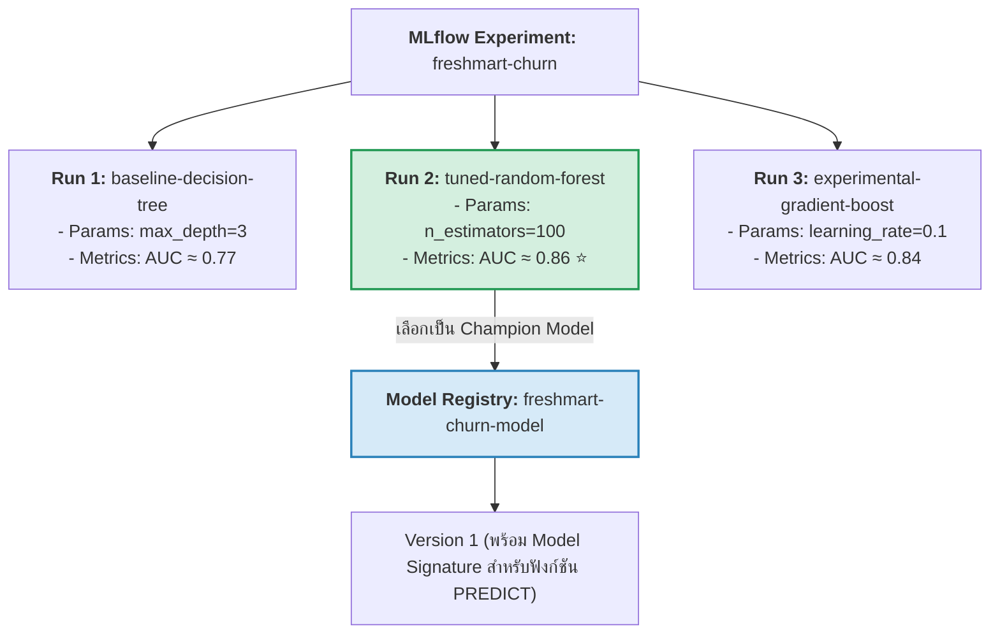
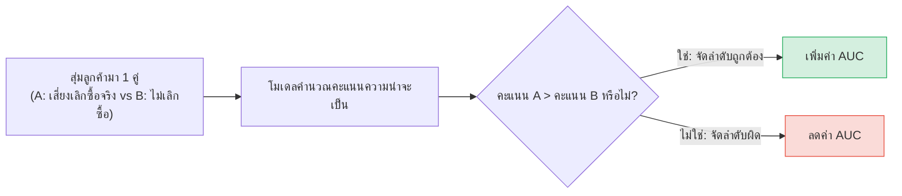

# M05 — ฝึกและติดตามโมเดลด้วย MLflow

อ้างอิง: Microsoft Learn — [Train and track ML models with MLflow](https://learn.microsoft.com/training/modules/train-track-model-fabric/) · สไลด์ M05 · [ML experiments](https://learn.microsoft.com/fabric/data-science/machine-learning-experiment) · [ML models](https://learn.microsoft.com/fabric/data-science/machine-learning-model)

หลังอ่านบทนี้ คุณจะเข้าใจว่า MLflow ใช้ติดตามการทดลองอย่างไร แบ่งชุดข้อมูลอย่างไร และ AUC วัดอะไรในโจทย์ churn  
ศัพท์ที่เกี่ยวข้อง: [MLflow](glossary.md#mlflow) · [AUC](glossary.md#auc-area-under-the-roc-curve) · [โมเดลเส้นฐาน](glossary.md#โมเดลเส้นฐาน-baseline) · [โมเดลที่เลือกใช้](glossary.md#โมเดลที่เลือกใช้-champion)

## MLflow คืออะไร: ระบบบันทึกการทดลองระดับมืออาชีพ

ในอดีต นักวิทยาศาสตร์ข้อมูลมักจดบันทึกการรันโมเดลลงในไฟล์ Excel หรือกระดาษทด: *"ครั้งนี้ใช้ความลึก 5 ได้คะแนน 82% พอเปลี่ยนเป็น 10 ได้ 85% แต่จำไม่ได้ว่าเซฟไฟล์โมเดลไว้ที่ไหน"*

**MLflow** แก้ปัญหานี้โดยทำหน้าที่เป็น **กล่องดำบันทึกการบิน (Flight Recorder)** สำหรับวงจร Machine Learning: บันทึกพารามิเตอร์ที่ใช้, คะแนนวัดผล, โครงสร้างข้อมูล, และไฟล์โมเดลเวอร์ชันต่าง ๆ โดยอัตโนมัติ  
บน Microsoft Fabric MLflow ถูกรวมเข้ากับระบบ Workspace ในตัวโดยไม่ต้องติดตั้งเซิร์ฟเวอร์แยก



## ลำดับชั้นของ MLflow บน Fabric

| องค์ประกอบ | หน้าที่ | ตัวอย่างในแล็บ FreshMart |
| :--- | :--- | :--- |
| **Experiment** | โฟลเดอร์รวมการทดลองสำหรับแก้ปัญหาธุรกิจหนึ่งโจทย์ | `freshmart-churn` |
| **Run** | การรันโค้ดฝึกโมเดลในแต่ละรอบ | `baseline-decision-tree`, `tuned-random-forest` |
| **Params** | ค่าตั้งต้นก่อนเริ่มฝึก (`mlflow.log_param`) | `n_estimators=100`, `max_depth=5` |
| **Metrics** | คะแนนวัดผลที่เกิดขึ้น (`mlflow.log_metric`) | `auc=0.8614`, `accuracy=0.835` |
| **Artifacts & Signature** | ตัวไฟล์โมเดลและสัญญาโครงสร้างอินพุต/เอาต์พุต | ไฟล์ `.bin` พร้อม signature ชี้คอลัมน์ |
| **Model Registry** | หอเกียรติยศสำหรับโมเดลที่ดีที่สุด (Champion) เพื่อนำไปใช้งาน | `freshmart-churn-model` เวอร์ชัน 1 |

---

## กับดัก Accuracy 81% และทำไมเราถึงต้องใช้ AUC?

> [!WARNING]
> **กับดัก Accuracy 81% ที่ทำให้ธุรกิจเจ๊งได้เงียบ ๆ:**  
> ในชุดข้อมูล FreshMart ลูกค้าเลิกซื้อ (Churn) มีสัดส่วนจริงประมาณ **19.3%** แปลว่าลูกค้าส่วนใหญ่ **80.7% ยังคงซื้ออยู่ตามปกติ**  
> หากมีคนสร้างโมเดลงี่เง่าที่ **"เดาสุ่มว่าไม่มีลูกค้าคนไหนเลิกซื้อเลยแม้แต่คนเดียว (ทาย 0 รวด)"**  
> - โมเดลนี้จะได้คะแนน **Accuracy สูงถึง 80.7% (เกือบ 81%)!**  
> - แต่ในความเป็นจริง โมเดลนี้ **จับลูกค้าที่กำลังจะหายไปไม่ได้เลยแม้แต่คนเดียว (Recall = 0%)** และสร้างความเสียหายให้ FreshMart อย่างมหาศาล!

### ทำความเข้าใจ AUC (Area Under the ROC Curve) ใน 1 นาที

ลองจินตนาการว่าคุณหยิบลูกค้าขึ้นมา 2 คนแบบสุ่ม: **คนที่ 1 คือคนที่กำลังจะเลิกซื้อจริง** และ **คนที่ 2 คือลูกค้าประจำ**  
- ค่า **AUC** คือ **ความน่าจะเป็นที่โมเดลจะให้คะแนนความเสี่ยงของ "คนที่ 1 สูงกว่าคนที่ 2"**
- **AUC = 0.50:** เท่ากับการโยนเหรียญหัวก้อย (เดาสุ่ม ไร้ประโยชน์)
- **AUC = 1.00:** การจัดอันดับสมบูรณ์แบบ แยกคนเลิกซื้อออกจากคนไม่เลิกซื้อได้อย่างเด็ดขาด
- **ในแล็บของเรา:** Random Forest ทำคะแนนได้ **AUC ประมาณ 0.86** (เหนือกว่า Decision Tree ที่ได้ ~0.77) หมายความว่าเราจัดอันดับความเสี่ยงให้ทีมการตลาดนำไปแจกคูปองได้อย่างแม่นยำสูงมาก!



## เมตริกอื่น ๆ ที่สะท้อนต้นทุนธุรกิจ

| เมตริก | นิยาม | นัยทางธุรกิจของ FreshMart |
| :--- | :--- | :--- |
| **Precision** | ในกลุ่มที่โมเดลชี้เป้าว่า "จะเลิกซื้อ" มีคนที่เลิกซื้อจริงกี่คน? | สำคัญเมื่อ **งบการตลาดหรือคูปองมีจำกัด** (ไม่อยากแจกคูปองฟรีให้คนที่ไม่คิดจะเลิกซื้อ) |
| **Recall** | ในกลุ่มคนที่เลิกซื้อจริงทั้งหมด โมเดลตามจับมาได้กี่คน? | สำคัญเมื่อ **การเสียลูกค้าประจำสร้างความเสียหายมหาศาล** (ยอมแจกคูปองเกิน ดีกว่าปล่อยให้ลูกค้าหลุดมือ) |
| **F1-Score** | ค่าเฉลี่ยฮาร์มอนิกสมดุลระหว่าง Precision และ Recall | ใช้เปรียบเทียบเมื่อต้องการจุดสมดุลที่ดีที่สุดทั้งสองฝั่ง |


### โครงโค้ดแนวทาง

```python
import mlflow
from sklearn.model_selection import train_test_split

mlflow.set_experiment("freshmart-churn")

with mlflow.start_run(run_name="rf-baseline"):
    # แบ่งข้อมูล จากนั้นฝึกโมเดล แล้วประเมินผล
    mlflow.log_param("model_type", "RandomForest")
    mlflow.log_metric("auc", auc_score)
    # log_model พร้อม signature ก่อนลงทะเบียน เพื่อใช้ PREDICT ได้
```

## Model Registry

หลังเลือกโมเดลที่ดีที่สุด ([champion](glossary.md#โมเดลที่เลือกใช้-champion)) จากการเปรียบเทียบบนหน้า Experiment:

1. ลงทะเบียนเป็นรายการ ML Model ใน workspace  
2. เก็บหมายเลขเวอร์ชัน, เมตริก, สภาพแวดล้อม  
3. ใช้เวอร์ชันนั้นตอนสร้างคำทำนายเป็นชุด (M06)

## AutoML ด้วย FLAML (ภาพรวม)

FLAML เป็นไลบรารีช่วยเลือกโมเดลและค่าตั้งอัตโนมัติในเวลาจำกัด — ใช้เมื่อต้องการโมเดลเส้นฐานเร็วและคุมงบประมวลผล  
ยังต้องเข้าใจเมตริกและการแบ่งข้อมูลเอง AutoML ไม่แทนที่การนิยามโจทย์ธุรกิจ

## Lab 3

- คู่มือ: [03-train-track-mlflow.md](../labs/instructions/03-train-track-mlflow.md)
- Notebook: `labs/notebooks/03-train-track-mlflow.ipynb`

เป้าหมาย: เปรียบเทียบการรันอย่างน้อยสองครั้ง แล้วลงทะเบียน `freshmart-churn-model`

## คำถามทบทวน

1. ขั้นตอนสำคัญที่สุดก่อนเรียก `model.fit()` คืออะไร — ดูหัวข้อการแบ่งชุดข้อมูล  
2. `log_param` กับ `log_metric` ต่างกันอย่างไร — ค่าตั้งก่อนฝึก กับ คะแนนวัดผล  
3. ทำไมต้องมีลายเซ็นโมเดล (signature) ก่อนใช้ PREDICT — ดู [glossary](glossary.md#ลายเซ็นโมเดล-model-signature)  
4. AUC วัดอะไร และทำไมในโจทย์ churn จึงไม่พึ่ง Accuracy อย่างเดียว — ดูตารางเมตริกด้านบน  

## ต่อไป

อ่านต่อ: [06 — สร้างคำทำนายแบบชุดด้วย PREDICT](06-batch-predict.md)
