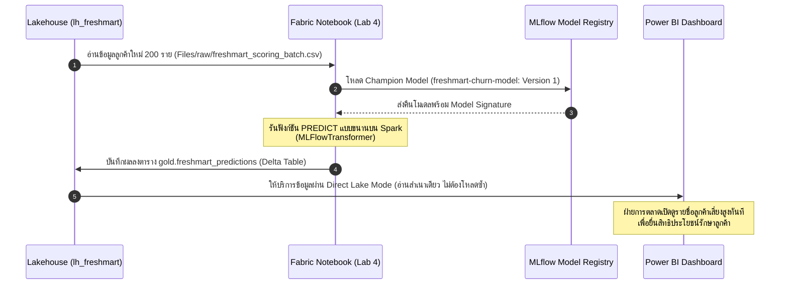

# M06 — สร้างคำทำนายแบบชุดด้วยฟังก์ชัน PREDICT

อ้างอิง: Microsoft Learn — [Generate batch predictions](https://learn.microsoft.com/training/modules/generate-batch-predictions-fabric/) · สไลด์ M06 · [Model scoring with PREDICT](https://learn.microsoft.com/fabric/data-science/model-scoring-predict)

หลังอ่านบทนี้ คุณจะเลือกได้ว่าควรทำนายเป็นชุดหรือแบบทันที และเรียก PREDICT ให้ตรงลายเซ็นโมเดลได้อย่างไร  
ศัพท์ที่เกี่ยวข้อง: [PREDICT](glossary.md#predict) · [ลายเซ็นโมเดล](glossary.md#ลายเซ็นโมเดล-model-signature) · [การทำนายเป็นชุด](glossary.md#การทำนายเป็นชุด-batch-scoring)

## จากห้องทดลองสู่ปฏิบัติการ: ส่งต่อผลทำนายให้ธุรกิจใช้งานได้จริง

โมเดล Machine Learning จะมีมูลค่าทางเศรษฐกิจก็ต่อเมื่อ **ถูกนำไปประมวลผลกับข้อมูลลูกค้าจริงเป็นประจำตามรอบธุรกิจ** เพื่อให้ฝ่ายการตลาดและฝ่ายปฏิบัติการนำรายชื่อไปดำเนินกิจกรรมต่อได้ทันที



## ทำนายเป็นชุด (Batch) vs ทำนายทันที (Real-Time)

| มิติเปรียบเทียบ | ทำนายเป็นชุด (Batch Scoring) | ทำนายแบบทันที (Real-Time Serving) |
| :--- | :--- | :--- |
| **จังหวะการตัดสินใจ** | รายวัน, รายสัปดาห์, หรือตามรอบแคมเปญ | เสี้ยววินาที (เช่น ตอนลูกค้ากำลังสแกนจ่ายเงิน) |
| **โครงสร้างประมวลผล** | ประมวลผลข้อมูลก้อนใหญ่พร้อมกันบนคลัสเตอร์ Spark | Web Service / API Endpoint ที่ต้องเปิดสแตนด์บายตลอดเวลา |
| **ต้นทุนและการดูแล** | **ประหยัด Capacity มากกว่า** (คิดค่าประมวลผลเฉพาะตอนรัน) | ต้นทุนสูงกว่า (ต้องจ่ายค่าเซิร์ฟเวอร์รองรับตลอด 24 ชม.) |
| **ในหลักสูตรนี้** | **ฟังก์ชัน PREDICT + Lakehouse (Lab 4)** | เหมาะกับงานแคมเปญรักษาลูกค้าที่ไม่จำเป็นต้องตอบทันที |

> [!TIP]
> **เกณฑ์การเลือก:** เลือกตาม "ความเร็วในการตัดสินใจของมนุษย์หรือระบบปลายทาง" — หากฝ่ายการตลาดส่ง SMS หรืออีเมลสัปดาห์ละ 1 ครั้ง การรันทำนายแบบ Batch รายคืนก็เพียงพอและประหยัดงบประมาณกว่าการสร้าง Real-time API หลายเท่า

## ลายเซ็นโมเดล (Model Signature): ปลั๊กไฟกับเต้ารับ

> [!IMPORTANT]
> **ทำไมฟังก์ชัน PREDICT ถึงบังคับให้มี Model Signature?**  
> เปรียบ **Model Signature** เหมือน **ขนาดของปลั๊กไฟและเต้ารับ**:  
> - ตอนฝึกโมเดล เราบอกว่าโมเดลต้องการตัวแปร 10 คอลัมน์ (เช่น `Age_scaled`, `Total_Spend_scaled`, `Frequency`) และจะคืนผลลัพธ์เป็นคอลัมน์ตัวเลข 0 หรือ 1  
> - เมื่อนำโมเดลไปใช้ทำนาย หากข้อมูลชุดใหม่มีชื่อคอลัมน์ผิดไปแม้แต่ตัวเดียว (เช่น `age_scaled` ตัวพิมพ์เล็ก) หรือชนิดข้อมูลไม่ตรง ฟังก์ชัน PREDICT จะปฏิเสธการทำงานทันทีเพื่อป้องกันไม่ให้ผลทำนายผิดเพี้ยนไปโดยที่ไม่มีใครรู้!

| รูปแบบ Signature | เมื่อใดที่ควรใช้ |
| --- | --- |
| **Column-based (อิงชื่อคอลัมน์)** | ใช้กับตารางธุรกิจทั่วไป (แบบที่ใช้ใน FreshMart) คอลัมน์และ Data types ต้องตรงกัน |
| **Tensor-based (อิงเทนเซอร์)** | ใช้กับงาน Deep Learning เช่น การประมวลผลภาพถ่ายหรือข้อความเสียง |

## PREDICT บน Spark ทำงานอย่างไร

คลาส `synapse.ml.predict.MLFlowTransformer` ใน Fabric จะดาวน์โหลดโมเดลจาก Model Registry มากระจายการคำนวณแบบขนาน (Distributed Execution) ไปยังทุกโหนดของ Spark ทำให้สามารถทำนายข้อมูลลูกค้านับล้านแถวได้ในเวลาเพียงไม่กี่นาที

พารามิเตอร์หลัก:
- `inputCols`: รายชื่อคอลัมน์ฟีเจอร์ที่ต้องป้อนให้โมเดล (ต้องตรงกับ Signature)
- `outputCol`: ชื่อคอลัมน์สำหรับเก็บผลการทำนาย (เช่น `prediction` หรือ `churn_risk`)
- `modelName` / `modelVersion`: ระบุชื่อโมเดลและเวอร์ชันที่อนุมัติเป็น Champion

### 3 ช่องทางการเรียกใช้ PREDICT บน Fabric

1. **Transformer API (PySpark):** `model.transform(df)` — วิธีหลักที่ยืดหยุ่นและเขียนโค้ดต่อยอดง่ายที่สุด
2. **Spark SQL:** `SELECT PREDICT('freshmart-churn-model/1', ...) FROM silver.scoring_batch`
3. **PySpark User-Defined Function (UDF):** `model.to_udf()`


หรือใช้ตัวช่วยจากหน้า ML Model โดยเลือก **Apply this version** (มีทั้งตัวช่วยทีละขั้น และคัดลอกแม่แบบโค้ด)

### ตัวอย่าง Transformer API

```python
from synapse.ml.predict import MLFlowTransformer

model = MLFlowTransformer(
    inputCols=feature_cols,
    outputCol="prediction",
    modelName="freshmart-churn-model",
    modelVersion=1,
)

scored = model.transform(scoring_spark_df)
scored.write.format("delta").mode("overwrite").saveAsTable("gold.freshmart_predictions")
```

## จากคะแนนสู่การตัดสินใจ

หลังเขียนตารางชั้น Gold:

- Power BI โหมด **Direct Lake** อ่านตารางทำนายจาก OneLake โดยไม่คัดลอกซ้ำ
- ตั้งเวลารัน notebook หรือ pipeline ให้ทำนายตามรอบ
- กำกับดูแลหลังขึ้นระบบ: ใครอนุมัติเวอร์ชันใหม่, ติดตามคุณภาพโมเดลเมื่อข้อมูลเปลี่ยน, แผนฝึกใหม่

## Lab 4

- คู่มือ: [04-batch-predict.md](../labs/instructions/04-batch-predict.md)
- Notebook: `labs/notebooks/04-batch-predict.ipynb`

เป้าหมาย: ทำนายชุด `freshmart_scoring_batch` (200 แถว) แล้วเขียนผลลงตาราง `gold.freshmart_predictions`

## คำถามทบทวน

1. ลายเซ็นอินพุตและเอาต์พุตของโมเดลเก็บอยู่ที่ใด — ดูหัวข้อลายเซ็นโมเดล  
2. การทำนายเป็นชุดต่างจากการทำนายแบบทันทีอย่างไรในมุมธุรกิจ — ดูตารางเปรียบเทียบด้านบน  
3. ทำไม PREDICT จึงบังคับให้มีลายเซ็นโมเดล — เพื่อจับคู่คอลัมน์และชนิดข้อมูลให้ตรง  

## ต่อไป

อ่านต่อ: [07 — เครื่องมือสมัยใหม่และธรรมาภิบาล](07-modern-ai.md)
