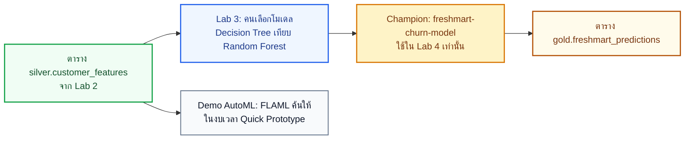

# AutoML บน Microsoft Fabric (ทางเลือก)

อ้างอิง: [Automated ML in Fabric](https://learn.microsoft.com/fabric/data-science/automated-ml-fabric) · [Low-code AutoML](https://learn.microsoft.com/fabric/data-science/low-code-automl) · [สร้างโมเดลด้วย Automated ML](https://learn.microsoft.com/fabric/data-science/how-to-use-automated-machine-learning-fabric) · [แนวคิด AutoML](https://learn.microsoft.com/fabric/data-science/automated-machine-learning-fabric)

เอกสารนี้เป็นส่วนขยายนอก 6 โมดูลหลักของ [Learning Path บน Microsoft Learn](https://learn.microsoft.com/training/paths/implement-data-science-machine-learning-fabric/)  
อ่านหลัง [M05 — MLflow](05-mlflow-training.md) และหลังทำ Lab 3 แล้ว ไม่แทนที่การฝึก Decision Tree กับ Random Forest ด้วยมือ

หลังอ่านบทนี้ คุณจะแยกได้ว่า AutoML ทำอะไรให้ อะไรยังเป็นหน้าที่คน และเมื่อไหร่ไม่ควรใช้ผลจาก AutoML เป็นโมเดลที่เลือกใช้ของ FreshMart  
ศัพท์ที่เกี่ยวข้อง: [AutoML](glossary.md#automl-automated-machine-learning) · [FLAML](glossary.md#flaml) · [โมเดลเส้นฐาน](glossary.md#โมเดลเส้นฐาน-baseline) · [โมเดลที่เลือกใช้](glossary.md#โมเดลที่เลือกใช้-champion) · [AUC](glossary.md#auc-area-under-the-roc-curve) · [Capacity](glossary.md#capacity)

สาธิตในห้อง: [คู่มือ Demo ผู้สอน](../labs/instructions/instructor-automl-demo.md)  
รอบ **6 ชั่วโมง** ตัด Demo นี้ออกจากกำหนดการหลัก — ดู [instructor-6h-runbook.md](instructor-6h-runbook.md)

## AutoML คืออะไร และไม่ใช่อะไร

**การเรียนรู้ของเครื่องอัตโนมัติ (Automated Machine Learning / AutoML)** ช่วยเลือกอัลกอริทึมและค่าตั้ง (hyperparameter) ให้ภายในเวลาหรือจำนวนรอบที่กำหนด แล้วบันทึกแต่ละรอบลง [MLflow Experiment](glossary.md#experiment--run)

บน Microsoft Fabric เครื่องยนต์ด้านหลังคือ **FLAML (Fast and Lightweight AutoML)** ของ Microsoft — ค้นหาโมเดลโดยคำนึงถึงงบประมวลผล ไม่ไล่ลองทุกค่าแบบหมดแรง

สิ่งที่ AutoML **ทำให้**

- ทดลองหลายอัลกอริทึมในงบเวลาเดียว
- ปรับค่าตั้งให้เข้าชุดข้อมูล
- บันทึกพารามิเตอร์และเมตริกลง Experiment อัตโนมัติ
- สร้างโมเดลเส้นฐานได้เร็วเมื่อโจทย์ชัดแล้ว

สิ่งที่ AutoML **ไม่แทนที่**

- การนิยามว่า “เลิกซื้อ” หมายถึงอะไร และจะวัดสำเร็จด้วยเมตริกใด
- การกันข้อมูลรั่วไหลเข้าโมเดล และการเตรียมฟีเจอร์ในชั้น Silver
- การตัดสินใจขึ้นโมเดลที่เลือกใช้ (champion) เข้าแคมเปญจริง
- ลายเซ็นโมเดลและการทำนายเป็นชุดใน Lab 4

> [!WARNING]
> โมเดลที่เลือกใช้ของแล็บนี้ยังคงเป็น `freshmart-churn-model` จาก Lab 3 (Random Forest)  
> ผลจาก AutoML ใช้เทียบเป็นเส้นฐานหรือสาธิตเท่านั้น ห้ามลงทะเบียนทับชื่อนี้ เพราะ Lab 4 เรียกฟังก์ชัน PREDICT จากเวอร์ชันนั้น

## สองทางเข้าบน Fabric

| ทางเข้า | เหมาะกับ | ได้สิ่งใด |
| :--- | :--- | :--- |
| **ตัวช่วยแบบเขียนโค้ดน้อย (low-code wizard)** | Demo ในห้อง, นักวิเคราะห์ที่อยากเห็นวงจรเร็ว | สมุดโค้ดที่ระบบสร้างให้, Experiment, รายการ ML Model |
| **เขียนโค้ดเองด้วย `flaml.AutoML`** | คนที่ทำ Lab 3 เสร็จเร็ว, งานที่ต้องล็อกงบเวลาและเมตริก | การรันซ้อนใน Experiment เดิม, คุม `time_budget` และ `metric` ได้ตรง |

ทั้งสองทางบันทึกลง MLflow เหมือน Lab 3 — ความต่างอยู่ที่ **ใครเป็นคนเลือกโมเดล**: ใน Lab 3 คนเลือก Decision Tree กับ Random Forest ใน AutoML ไลบรารีค้นให้ภายในงบที่กำหนด

เปิดตัวช่วยได้จากรายการ **Experiment**, **ML Model**, หรือ **Notebook** ใน workspace  
เอกสารทางการ: [Use the low-code AutoML interface](https://learn.microsoft.com/fabric/data-science/low-code-automl)

## ประเภทงานที่ AutoML รองรับ

จับคู่กับโจทย์ FreshMart จาก [M02](02-data-science-process.md):

| ประเภทงานในตัวช่วย | คำถามธุรกิจ | ในหลักสูตรนี้ |
| :--- | :--- | :--- |
| **Binary Classification** | ลูกค้าคนนี้จะเลิกซื้อหรือไม่ | ใช้ใน Demo — คอลัมน์เป้า `Churn` |
| **Multi-Class Classification** | จัดลูกค้าเป็นหลายกลุ่มที่กำหนดไว้ล่วงหน้า | นอกขอบเขตแล็บ |
| **Regression** | คาดยอดขายหรือมูลค่าเป็นตัวเลข | นอกขอบเขตแล็บ |
| **Forecasting** | พยากรณ์ตามแกนเวลา | นอกขอบเขตแล็บ |

FreshMart ในแล็บนี้เป็นโจทย์จำแนกสองกลุ่มที่มีสัดส่วนไม่เท่ากัน (Churn ประมาณ 19.3%) จึงต้องให้ AutoML 최적화 **AUC** ไม่ใช่ Accuracy — เหตุผลเดียวกับ [M05](05-mlflow-training.md#กับดัก-accuracy-81-และทำไมเราถึงต้องใช้-auc)

## โหมดการค้นหาในตัวช่วย

| โหมด | พฤติกรรม | ใช้ในห้องเรียนนี้หรือไม่ |
| :--- | :--- | :--- |
| **Quick Prototype** | ได้ผลเร็ว เหมาะทดลองและสาธิต | **ใช้โหมดนี้เท่านั้น** เมื่อสาธิตบน Fabric Trial |
| **Interpretable Mode** | นานขึ้น เน้นโมเดลที่อธิบายได้ง่ายกว่า | ไม่ใช้ใน Demo หลัก |
| **Best Fit** | ค้นนานขึ้นเพื่อหาโมเดลที่ดีที่สุดในงบใหญ่ | ห้ามใช้บน Trial ของทั้งคลาส — กิน [Capacity](glossary.md#capacity) |
| **Custom** | ปรับรายละเอียดเอง | ใช้เมื่อผู้สอนต้องการล็อกเมตริกหรือรายชื่ออัลกอริทึม |

## การรันบน Spark กับลายเซ็นโมเดล

ตอนจบตัวช่วย คุณเลือกได้สองแบบ:

1. **ฝึกหลายโมเดลพร้อมกัน** — โหลดข้อมูลเข้า pandas แล้วให้คลัสเตอร์ลองหลายรอบขนานกัน ชุด FreshMart มีประมาณ 1,500 แถวจึงเข้าได้
2. **ฝึกทีละโมเดลบน Spark** — เหมาะชุดใหญ่ที่ต้องการประมวลผลกระจาย ใช้ Spark กับ SynapseML

> [!IMPORTANT]
> โหมด Spark **ยังไม่บันทึกโครงอินพุต/เอาต์พุต (schema)** ที่ฟังก์ชัน **PREDICT** ของ SynapseML ต้องการ  
> หากสาธิตโหมดนี้ อย่าคาดว่าจะกด **Apply this version** แล้วไปต่อ Lab 4 ได้ ให้โหลดโมเดลด้วย MLflow ใน notebook แทน  
> แหล่งที่มา: [หมายเหตุในเอกสาร low-code AutoML](https://learn.microsoft.com/fabric/data-science/low-code-automl#set-up-an-automated-ml-trial)

นี่คือเหตุผลเชิงสถาปัตยกรรมที่ Demo ต้องแยกชื่อโมเดลออกจาก `freshmart-churn-model`

## ตำแหน่งในวงจร FreshMart



Lab 3 สอนวินัย: แบ่งชุดฝึก/ทดสอบ, เลือกเมตริก, เปรียบเทียบรัน, ลงทะเบียนโมเดลที่ชนะ  
AutoML สอนภาพผลิตภัณฑ์: องค์กรเร่งหาเส้นฐานได้ แต่คนยังต้องรับผิดชอบโจทย์ ข้อมูล และโมเดลที่ขึ้นใช้งาน

## เมื่อไหร่ควรใช้ เมื่อไหร่ไม่ควรใช้

ใช้ AutoML เมื่อ

- โจทย์และคอลัมน์เป้าชัดแล้ว (เช่น `Churn` หลัง Lab 2)
- ต้องการโมเดลเส้นฐานเร็ว เพื่อเทียบกับโมเดลที่คนเลือกเอง
- งบประมวลผลจำกัด และยอมรับว่าผลแต่ละครั้งอาจไม่ซ้ำเป๊ะ

อย่าใช้ AutoML เมื่อ

- ยังไม่สำรวจข้อมูล หรือยังมีข้อมูลรั่วไหลเข้าโมเดล
- ต้องการผลลัพธ์ซ้ำได้ทุกเครื่องเพื่อตรวจแล็บ (เช่น จุดผ่าน AUC ของ Lab 3)
- จะส่งโมเดลเข้า PREDICT แต่เลือกโหมด Spark ที่ไม่มีลายเซ็น
- ทั้งคลาสใช้ Fabric Trial ร่วมโควตา แล้วเปิด **Best Fit** พร้อมกัน

## โครงโค้ดแนวทาง (เขียนเองด้วย FLAML)

ใช้เมื่อสาธิตทางโค้ด หรือให้ผู้เรียนที่ทำ Lab 3 เสร็จเร็วลองเป็นงานเสริม  
ล็อกงบเวลาให้สั้น และใช้เมตริก `roc_auc` ให้ตรงโจทย์ churn

```python
import mlflow
from flaml import AutoML

mlflow.set_experiment("freshmart-churn-automl-demo")

settings = {
    "time_budget": 60,
    "metric": "roc_auc",
    "task": "classification",
    "seed": 42,
    "force_cancel": True,
}

automl = AutoML()
with mlflow.start_run(run_name="flaml-quick-prototype"):
    automl.fit(X_train, y_train, **settings)
    mlflow.log_metric("best_val_auc", 1 - automl.best_loss)
```

- `time_budget=60` จำกัดการค้นเหลือประมาณหนึ่งนาที — เหมาะ Trial และ Demo
- `metric="roc_auc"` สอดคล้องกับเหตุผลใน M05 ที่ไม่ใช้ Accuracy เป็นตัวตัดสิน
- อย่าเรียก `mlflow.register_model` ไปที่ชื่อ `freshmart-churn-model`

เอกสารทางการของค่าตั้งและข้อมูลนำเข้า: [Code-first AutoML](https://learn.microsoft.com/fabric/data-science/python-automated-machine-learning-fabric)

## Demo ในห้องเรียน

- คู่มือผู้สอน: [instructor-automl-demo.md](../labs/instructions/instructor-automl-demo.md)
- ใช้เวลาประมาณ 8–12 นาที หลัง Lab 3 ก่อนเข้า Lab 4
- ผู้เรียนดู ไม่ต้องรันตามทั้งคลาส

## คำถามทบทวน

1. AutoML เลือกอะไรให้อัตโนมัติ และอะไรยังเป็นหน้าที่คน — ดูหัวข้อแรกของบทนี้  
2. ทำไมโจทย์ FreshMart ต้องให้ AutoML ใช้ AUC ไม่ใช่ Accuracy — ดู [M05](05-mlflow-training.md#กับดัก-accuracy-81-และทำไมเราถึงต้องใช้-auc)  
3. โหมด Spark ของตัวช่วยทำให้ Lab 4 พังได้อย่างไร — ดูหัวข้อลายเซ็นโมเดล  
4. เมื่อไหร่จึงขึ้นผล AutoML เป็นโมเดลที่เลือกใช้ของแคมเปญได้ — ดูหัวข้อเมื่อไหร่ควรใช้ และ [champion](glossary.md#โมเดลที่เลือกใช้-champion)

## ต่อไป

- ผู้สอน: เปิด [คู่มือ Demo AutoML](../labs/instructions/instructor-automl-demo.md)
- ผู้เรียน: กลับไปเส้นหลักที่ [06 — สร้างคำทำนายแบบชุดด้วย PREDICT](06-batch-predict.md)
