# กำหนดการห้องเรียน 6 ชั่วโมง (ผู้สอน)

คอร์สฉบับสไลด์ `DP-604-TH-12H` ออกแบบมาประมาณ 12 ชั่วโมง (บรรยายประมาณ 70%)  
รอบนี้ **lab รวมบรรยาย = 6 ชั่วโมง** — ต้องกลับสัดส่วน: แล็บเป็นแกน บรรยายเหลือเท่าที่ต้องใช้ก่อนลงมือ

เอกสารนี้ใช้คู่กับ [00-overview.md](00-overview.md) และ [labs/README.md](../labs/README.md)  
อย่าขยาย Lab 2 ให้ Wrangler เป็นตัวสร้างฟีเจอร์โมเดล และอย่าบังคับรายงาน Power BI เป็นเกณฑ์ผ่าน Lab 4

## สัดส่วนเวลา (360 นาที สุทธิ ไม่รวมพักกลางวัน)

| บล็อก | นาที | สัดส่วน | หมายเหตุ |
| --- | ---: | ---: | --- |
| บรรยาย (M00–M08 บีบ) | 110 | 31% | สไลด์ 12 ชม. ใช้ไม่ได้ทั้งม้วน — เลือกใบที่ต้องพูดก่อนแล็บ |
| แล็บในห้อง (Lab 0 ตรวจ + Lab 1–4) | 150 | 42% | Lab 0 เต็ม 30–40 นาที **ย้ายไปก่อนเข้าห้อง** |
| กันพลาด / คนค้างแล็บ / Q&A | 80 | 22% | อย่าตัดก้อนนี้เพื่อเพิ่มสไลด์ |
| พักสั้น 2 รอบ | 20 | 6% | รวมใน 6 ชม. |

พักกลางวัน 60 นาที **ไม่นับ** ใน 6 ชั่วโมง  
งานก่อนเข้าห้อง (Fabric Trial + Lakehouse + อัปโหลด CSV + Import notebook) **ไม่นับ** ประมาณ 30–40 นาที

```mermaid
gantt
    title รอบ 6 ชั่วโมง (09:00-16:00 ไม่รวมพักกลางวัน)
    dateFormat HH:mm
    axisFormat %H:%M
    section เช้า
    M00 ภารกิจและกติกา           :m00, 09:00, 15m
    M01 OneLake และ Medallion     :m01, 09:15, 15m
    Lab 0 ตรวจ verification       :l0,  09:30, 10m
    M02+M03 วงจรและ EDA           :m23, 09:40, 10m
    Lab 1 สำรวจข้อมูล             :l1,  09:50, 30m
    พัก                           :br1, 10:20, 10m
    M04 Wrangler และข้อมูลรั่ว    :m04, 10:30, 10m
    Lab 2 เตรียมฟีเจอร์           :l2,  10:40, 30m
    M05 MLflow                    :m05, 11:10, 15m
    Lab 3 เริ่มฝึกโมเดล           :l3a, 11:25, 35m
    section บ่าย
    Lab 3 จบและ Experiment        :l3b, 13:00, 15m
    M06 PREDICT และ Gold          :m06, 13:15, 10m
    Lab 4 ทำนายเป็นชุด            :l4,  13:25, 30m
    พัก                           :br2, 13:55, 10m
    M07 สามข้อความ                :m07, 14:05, 15m
    M08 สรุปและแผน 30 วัน         :m08, 14:20, 20m
    กันพลาดและ Q&A                :buf, 14:40, 80m
```

## งานก่อนเข้าห้อง (บังคับ — ถ้าไม่ทำ รอบ 6 ชม. จะเลื่อนทั้งบ่าย)

ส่งให้ผู้เรียนทำตาม [Lab 0](../labs/instructions/00-lakehouse-setup.md) **ก่อนวันอบรม** จนเห็นข้อความ `Lab 0 verification passed`

1. ลงทะเบียน [Fabric Trial](https://aka.ms/fabrictrial)
2. สร้าง workspace ของตนเอง (แนะนำชื่อ `labs`) — **อย่าเชิญใครเข้า**
3. สร้าง Lakehouse `lh_freshmart` เปิด schemas
4. `git clone` แล้วอัปโหลด `labs/data/*.csv` ไปที่ `Files/raw/`
5. Import notebook จาก `labs/notebooks/` แล้วแนบ Default Lakehouse = `lh_freshmart`
6. รัน `00-environment-verification.ipynb` จนผ่านจุดตรวจ

เช้าวันอบรมผู้สอนเดินดูหน้าจอ 10 นาที แล้วไป Lab 1 — **อย่ารอรอสร้าง Trial ในห้องทั้งคลาส**

## กำหนดการนาทีต่อนาที

### เช้า 09:00–12:00 (180 นาที)

| นาฬิกา | นาที | ชนิด | ทำอะไร | สไลด์ที่ใช้ |
| --- | ---: | --- | --- | --- |
| 09:00–09:15 | 15 | บรรยาย | ภารกิจ FreshMart, กติกา workspace ส่วนตัว, เส้นทาง Lab 0–4 | M00 ใบเปิด + กติกา |
| 09:15–09:30 | 15 | บรรยาย | OneLake, ชั้น Bronze/Silver/Gold, ทำไมไม่ copy ไฟล์ข้ามระบบ | M01 เฉพาะสถาปัตยกรรมที่ใช้แล็บ |
| 09:30–09:40 | 10 | แล็บ | ตรวจ Lab 0 — เห็น `bronze.transactions` 3,000 แถว และ `bronze.customers` 1,500 แถว | — |
| 09:40–09:50 | 10 | บรรยาย | วงจร Data Science + ทำไมต้องสำรวจก่อนฝึก (ข้ามทฤษฎียาวของ M02) | M02 ใบวงจร + M03 ใบคำถามธุรกิจ |
| 09:50–10:20 | 30 | แล็บ | Lab 1 — จบเมื่อ `Lab 1 verification passed` และจด 3 ข้อส่ง Lab 2 | — |
| 10:20–10:30 | 10 | พัก | — | — |
| 10:30–10:40 | 10 | บรรยาย | Data Wrangler ใช้สำรวจและสร้างโค้ด — สถิติฝึกโมเดลล็อกใน `feature_params.json` | M04 ใบ low-code **ปรับโทนตามแล็บ** |
| 10:40–11:10 | 30 | แล็บ | Lab 2 ส่วน A เปิด Wrangler จริง แล้วส่วน B รันเซลล์สัญญา | — |
| 11:10–11:25 | 15 | บรรยาย | Experiment, `test_roc_auc`, โมเดลที่เลือกใช้ — อย่าใช้คำว่า Leaderboard | M05 |
| 11:25–12:00 | 35 | แล็บ | Lab 3 เริ่ม — ฝึก Decision Tree กับ Random Forest | — |

### บ่าย 13:00–16:00 (180 นาที)

| นาฬิกา | นาที | ชนิด | ทำอะไร | สไลด์ที่ใช้ |
| --- | ---: | --- | --- | --- |
| 13:00–13:15 | 15 | แล็บ | Lab 3 จบ — ลงทะเบียน `freshmart-churn-model` แล้วเปิด Experiment เทียบสองรัน | — |
| 13:15–13:25 | 10 | บรรยาย | ทำนายเป็นชุด, ห้ามคิดสเกลใหม่จากชุด 200 คน, ตาราง Gold | M06 |
| 13:25–13:55 | 30 | แล็บ | Lab 4 — เขียน `gold.freshmart_predictions` 200 แถว | — |
| 13:55–14:05 | 10 | พัก | — | — |
| 14:05–14:20 | 15 | บรรยาย | Copilot / Semantic Link / Responsible AI อย่างละหนึ่งประโยค | M07 ใบสรุปเท่านั้น |
| 14:20–14:40 | 20 | บรรยาย | สรุปวงจร + แผน 30 วัน + คำถามปิด | M08 |
| 14:40–16:00 | 80 | กันพลาด | คนที่แล็บค้าง, Q&A, ถ้าเหลือจริงจึงสาธิต AutoML บนจอผู้สอน | ดูด้านล่าง |

Lab 4 ขั้น **New report** จาก SQL analytics endpoint เป็นทางเลือกใน 8 นาทีสุดท้ายของช่วงแล็บ — **ไม่ใช่เกณฑ์ผ่าน** และไม่สร้างแล็บ Power BI ใหม่

## สิ่งที่ตัดจากรอบ 12 ชั่วโมง

| รายการ | การตัดสินใจในรอบ 6 ชม. | เหตุผล |
| --- | --- | --- |
| Lab 0 เต็มในห้อง | ย้ายเป็นงานก่อนเข้าห้อง | กิน 30–40 นาที และ Spark รอบแรกช้า |
| M02 เต็มโมดูล | ผสาน 10 นาทีกับ M03 | วงจรเห็นได้จากแล็บมากกว่าจากสไลด์ |
| M07 เต็มโมดูล | เหลือ 15 นาที สามข้อความ | นอก Learning Path หลัก |
| Demo AutoML 8–12 นาที | ตัดจากกำหนดการหลัก | ใช้ได้เฉพาะเมื่อ buffer เหลือ และผู้สอนรันล่วงหน้าแล้ว |
| ขยาย Lab 2 ให้คลิก Fill / Scale | **ห้าม** | params คนละชุด แล้ว Lab 3–4 พัง |
| บังคับรายงาน Power BI ใน Lab 4 | ไม่บังคับ | คอร์สจบที่ตาราง Gold |
| สะท้อนโจทย์องค์กร 70 นาที | พับเข้า M08 20 นาที | ไม่มีเวลาเวิร์กช็อป |

## ถ้าห้องช้า — ลำดับตัด (ตัดจากล่างขึ้นบน)

อย่าข้าม Lab 3 (โมเดลที่เลือกใช้) และ Lab 4 (ตาราง Gold) — นั่นคือสิ่งที่ผู้เรียนต้องกลับไปทำซ้ำได้

1. ตัด M07 ทั้งก้อน (ได้ 15 นาที)
2. ย่อ M08 เหลือ 5 นาที คำถามปิดข้อเดียว
3. ตัดขั้น New report ของ Lab 4
4. Lab 1 ข้ามกราฟบางใบ เหลือจุดตรวจและอัตรา Churn ประมาณ 19.3%
5. **ห้าม** ตัด Lab 3 ลงทะเบียนโมเดล หรือ Lab 4 เขียน Gold

## ถ้าผู้เรียนไม่ได้ทำ Lab 0 มาก่อน

อย่ารอทั้งคลาสสร้าง Trial พร้อมกัน

- คนที่ผ่าน Lab 0 แล้วไป Lab 1 ตามนาฬิกา
- คนที่ยังไม่ผ่านให้นั่งทำ Lab 0 เองตามคู่มือ — ผู้สอนไม่เชิญเข้า workspace
- จุดรวมคลาสครั้งถัดไปคือ **หลังพักเช้า (10:30)** ก่อน M04  
  คนที่ยังไม่มี Bronze จะดู Lab 2–4 บนจอผู้สอนแล้วตามให้ทันในช่วงกันพลาดบ่าย

## สไลด์ที่ต้องพูดให้ตรงแล็บ (อย่าใช้โหมดขาย)

| หัวข้อ | พูดในรอบ 6 ชม. |
| --- | --- |
| Data Wrangler | เปิดคลิกดูแล้วกด **Add code to notebook** ได้ — ฟีเจอร์โมเดลล็อกด้วยโค้ดสัญญาเพื่อกันข้อมูลรั่วไหล |
| หน้าเทียบโมเดล | เปิด item **Experiment** เทียบ `test_roc_auc` สองรันได้ทันที — ยังต้องเขียนโค้ดฝึกโมเดล และไม่มีป้ายชื่อ Leaderboard |
| Power BI | เขียนตาราง Gold แล้วเปิดรายงาน Direct Lake ได้ ไม่ต้องสร้าง API — แล็บจบที่ตาราง ไม่ได้ส่งมอบแดชบอร์ดสำเร็จรูป |

บทพูด 3 นาทีก่อน Lab 2 ใช้ชุดเดิม: Wrangler เห็นลูกค้าทั้ง 1,500 คนรวมชุดทดสอบ — เลยไม่ให้คลิก Fill Age แล้วเอาโค้ดนั้นไปแทน `fit_preprocessor`

## หลังห้องเรียน

ส่งลิงก์เอกสารที่ไม่ได้สอนเต็ม:

- [07-modern-ai.md](07-modern-ai.md)
- [08-wrap-up-roadmap.md](08-wrap-up-roadmap.md)
- [09-automl.md](09-automl.md) และ [คู่มือ Demo ผู้สอน](../labs/instructions/instructor-automl-demo.md)
- [resources.md](resources.md) สำหรับ Learning Path บน Microsoft Learn
