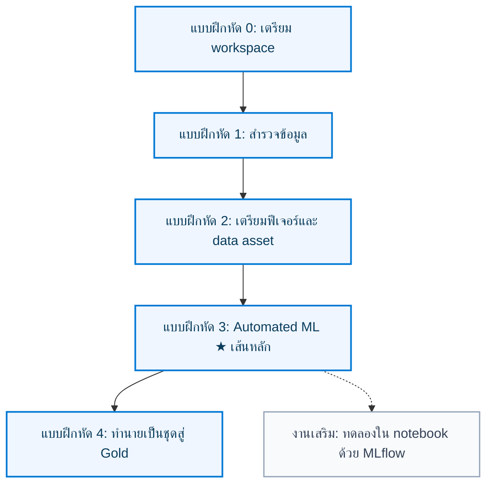

# FreshMart Labs — Azure Machine Learning (ทางเลือกฉุกเฉิน)

ชุดปฏิบัติการ**แยกจากแทร็ก Fabric** สำหรับกรณีที่ **ใช้ Fabric Capacity ไม่ได้**  
กรณีศึกษา: **FreshMart Customer Churn** — เตรียมข้อมูล หาโมเดลที่ดีที่สุดด้วย **Automated ML** แล้วทำนายชุดใหม่สำหรับแคมเปญรักษาลูกค้า

โครงแล็บเทียบเคียงโมดูล Learn [Find the best classification model with Automated Machine Learning](https://learn.microsoft.com/training/modules/find-best-classification-model-automated-machine-learning/) และแนวทาง exam [AI-300](https://learn.microsoft.com/credentials/certifications/resources/study-guides/ai-300) (สร้าง workspace, data asset, compute, จัดการโมเดลด้วย MLflow)

> [!IMPORTANT]
> โฟลเดอร์นี้**ไม่แก้และไม่แทนที่**ไฟล์ใน `labs/`  
> เมื่อ Capacity ของ Fabric กลับมา ให้กลับไปใช้ [labs/README.md](../labs/README.md)

| เอกสารช่วยเรียน | ลิงก์ |
| --- | --- |
| Docs ทฤษฎี | [../docs/README.md](../docs/README.md) |
| อภิธานศัพท์ | [../docs/glossary.md](../docs/glossary.md) |
| มาตรฐานภาษาไทย | [../docs/writing-style-th.md](../docs/writing-style-th.md) |
| โน้ตผู้สอน | [instructions/instructor-automl-demo.md](instructions/instructor-automl-demo.md) |

## วัตถุประสงค์การเรียนรู้

หลังจบชุดนี้ คุณจะสามารถ:

- สร้าง Azure ML workspace, compute instance และ data asset
- เตรียมข้อมูลจำแนกประเภทให้ Automated ML ใช้ได้
- ตั้งค่าและส่งงาน AutoML แล้วเปรียบเทียบโมเดลจากเมตริกหลัก
- ลงทะเบียนโมเดลที่เลือกใช้ แล้วทำนายเป็นชุดสู่ชั้น Gold

## เส้นทางหลัก: AutoML นำ

ลำดับเหมือน Learning Path ของ Learn ที่ให้ **หาโมเดลด้วย AutoML ก่อน** แล้วค่อยทดลองใน notebook ด้วย MLflow เป็นงานเสริม



| แบบฝึกหัด | คู่มือ | สมุดโค้ด | สิ่งที่ส่งมอบ |
| :---: | :--- | :--- | :--- |
| **0** | [00-workspace-setup.md](instructions/00-workspace-setup.md) | `00-environment-verification.ipynb` | Workspace + compute + Data asset Bronze |
| **1** | [01-explore-data.md](instructions/01-explore-data.md) | `01-explore-data.ipynb` | ข้อสังเกตคุณภาพข้อมูลและพฤติกรรม Churn |
| **2** | [02-preprocess-data-wrangler.md](instructions/02-preprocess-data-wrangler.md) | `02-preprocess-data-wrangler.ipynb` | `silver-customer-features` + `feature_params.json` |
| **3** | [03-automl-classification.md](instructions/03-automl-classification.md) | `03-automl-classification.ipynb` | Experiment AutoML จาก Data asset + Champion |
| **4** | [04-batch-predict.md](instructions/04-batch-predict.md) | `04-batch-predict.ipynb` | Data asset `gold-freshmart-predictions` |
| เสริม | [03-train-track-mlflow.md](instructions/03-train-track-mlflow.md) | `03-train-track-mlflow.ipynb` | เทียบ Decision Tree / Random Forest ด้วยมือ — **ไม่ทับ Champion** |

อ้างอิงตัวช่วย studio: [Tutorial: Train a classification model with no-code AutoML](https://learn.microsoft.com/azure/machine-learning/tutorial-first-experiment-automated-ml)

## จับคู่กับแทร็ก Fabric

| แทร็ก Fabric (`labs/`) | แทร็ก Azure ML นี้ |
| :--- | :--- |
| Demo AutoML ของผู้สอน (ทางเลือก) | **แบบฝึกหัด 3 คือเส้นหลัก** — ผู้เรียนเดิน Automated ML เอง |
| Lab 3 ฝึก Decision Tree / Random Forest | งานเสริมหลัง AutoML |
| Lakehouse + PREDICT | หน้า **Data** (Data asset) + `mlflow.pyfunc` |

วงจรธุรกิจ FreshMart และสัญญา 14 ฟีเจอร์ยังใช้ชุดข้อมูลเดียวกันจาก `labs/data/`

## เส้นทางผู้เรียน

1. มี Azure subscription (บทบาท Contributor หรือ Owner)
2. `git clone` repository นี้ หรืออัปโหลดโน้ตบุ๊กกับ CSV
3. ทำแบบฝึกหัด 0 ถึง 4 ตามลำดับ — อ่านคู่มือแล้วทำทีละ**งาน**
4. งานเสริม MLflow ทำได้หลังแบบฝึกหัด 3 ผ่านแล้วเท่านั้น

> [!WARNING]
> Compute instance **คิดเงินตามเวลาที่เปิดอยู่**  
> ตั้ง idle shutdown แล้วกด **Stop** เมื่อเลิกใช้  
> ในแบบฝึกหัดผู้เรียน: ใช้ compute instance ที่มีอยู่ — **อย่า Deploy** เป็น web service

## ข้อมูลที่ใช้

ใช้ชุดเดียวกับแทร็ก Fabric ที่ `labs/data/` — อย่าไปแก้ไฟล์ใน `labs/`

ลงทะเบียนเป็น Data asset ในหน้า **Data** ของ Azure ML studio:

| Data asset | ประเภท | ที่มา | แบบฝึกหัด |
| :--- | :--- | :--- | :---: |
| `bronze-transactions` | Tabular | `freshmart_transactions.csv` (3,000 แถว) | 0–1 |
| `bronze-customers` | Tabular | `freshmart_customers.csv` (1,500 แถว) | 0–2 |
| `scoring-batch` | Tabular | `freshmart_scoring_batch.csv` (200 แถว ไม่มี Churn) | 0, 4 |
| `silver-customer-features` | Tabular | ผลแบบฝึกหัด 2 | 2–3 |
| `gold-freshmart-predictions` | Tabular | ผลแบบฝึกหัด 4 | 4 |

สำเนาไฟล์ชั้นถัดไปยังอยู่ที่ `data/bronze` · `data/silver` · `data/gold` · `data/params` บน compute instance

## ทดสอบก่อนขึ้นห้องเรียน

```powershell
pip install -r labs/requirements-test.txt
pytest labs-azureml/tests -v
python labs-azureml/scripts/generate_notebooks.py
```
