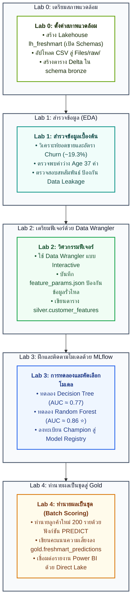

# FreshMart Labs — Microsoft Fabric Data Science

ชุดปฏิบัติการสำหรับ **นักวิเคราะห์ข้อมูลที่อยากเข้าใจวงจรงานวิทยาศาสตร์ข้อมูล**  
กรณีศึกษา: **FreshMart Customer Churn** — สำรวจข้อมูล เตรียมฟีเจอร์ ฝึกโมเดลด้วย MLflow แล้วเขียนผลลงตาราง Gold สำหรับแคมเปญรักษาลูกค้า

| เอกสารช่วยเรียน | ลิงก์ |
| --- | --- |
| Docs ทฤษฎี | [../docs/README.md](../docs/README.md) |
| อภิธานศัพท์ | [../docs/glossary.md](../docs/glossary.md) |
| มาตรฐานภาษาไทย | [../docs/writing-style-th.md](../docs/writing-style-th.md) |
| AutoML (ทางเลือก) | [../docs/09-automl.md](../docs/09-automl.md) · [Demo ผู้สอน](instructions/instructor-automl-demo.md) |

## เส้นทางผู้เรียน

1. ลงทะเบียน [Fabric Trial](https://aka.ms/fabrictrial) ด้วยบัญชีของตนเอง
2. `git clone` repository นี้
3. สร้าง workspace ของตนเองบน Fabric (แนะนำชื่อ **`labs`**) — **อย่าเชิญใครเข้า**
4. สร้าง Lakehouse **`lh_freshmart`** แล้วอัปโหลด CSV จาก `labs/data/` ตาม [Lab 0](instructions/00-lakehouse-setup.md)
5. Import notebook จาก `labs/notebooks/` แล้วแนบ Default Lakehouse = **`lh_freshmart`**
6. ทำตามคู่มือใน `labs/instructions/` — รันทีละขั้น ดูผล แล้วไปต่อ

> [!IMPORTANT]
> **กติกาสำคัญสำหรับการใช้งานห้องปฏิบัติการ (Single-User Workspace Rule):**  
> แต่ละท่านต้องใช้ **Fabric Trial และ Workspace ส่วนตัวของตนเอง** (แนะนำให้ตั้งชื่อว่า `labs`)  
> **ห้ามเชิญเพื่อนร่วมคลาสหรือผู้สอนเข้า Workspace โดยเด็ดขาด** เพื่อป้องกันปัญหา Spark Session ชนกัน และป้องกันการแย่งโควตา Capacity ของกันและกัน

## แผนผังลำดับการลงมือปฏิบัติ (Lab Pipeline)



## ลำดับแล็บและผลลัพธ์ที่คาดหวัง

| Lab | คู่มือปฏิบัติ | สมุดโค้ด (Notebook) | ผลลัพธ์ที่ส่งมอบ (Key Deliverable) |
| :---: | :--- | :--- | :--- |
| **0** | [00-lakehouse-setup.md](instructions/00-lakehouse-setup.md) | `00-environment-verification.ipynb` | Workspace ส่วนตัว + `lh_freshmart` พร้อมตาราง Bronze ผ่านการทดสอบ |
| **1** | [01-explore-data.md](instructions/01-explore-data.md) | `01-explore-data.ipynb` | รายงานสถิติและกราฟพฤติกรรม Churn ของลูกค้า FreshMart |
| **2** | [02-preprocess-data-wrangler.md](instructions/02-preprocess-data-wrangler.md) | `02-preprocess-data-wrangler.ipynb` | ตาราง `silver.customer_features` และไฟล์ `feature_params.json` |
| **3** | [03-train-track-mlflow.md](instructions/03-train-track-mlflow.md) | `03-train-track-mlflow.ipynb` | Experiment เปรียบเทียบสองโมเดล และ Champion `freshmart-churn-model` |
| **4** | [04-batch-predict.md](instructions/04-batch-predict.md) | `04-batch-predict.ipynb` | ตาราง Delta `gold.freshmart_predictions` สำหรับทีมการตลาด |

## สำหรับผู้สอน (ทางเลือก หลัง Lab 3)

สาธิต AutoML บน workspace ของผู้สอนเท่านั้น ผู้เรียนดู ไม่รันตามทั้งคลาส และห้ามทับ `freshmart-churn-model`

| เอกสาร | ใช้เมื่อ |
| :--- | :--- |
| ทฤษฎี [09-automl.md](../docs/09-automl.md) | อธิบายว่า AutoML ทำอะไรให้ และอะไรยังเป็นหน้าที่คน |
| คู่มือ [instructor-automl-demo.md](instructions/instructor-automl-demo.md) | เดินตัวช่วย Quick Prototype 8–12 นาที ก่อนเข้า Lab 4 |


## ข้อมูลที่ใช้

อยู่ที่ `Files/raw/` ของ Lakehouse และสำเนาใน `labs/data/`

- `freshmart_transactions.csv` — 3,000 แถว (ยอดขายและของเสีย)
- `freshmart_customers.csv` — 1,500 แถว (สมาชิกและสถานะ Churn)
- `freshmart_scoring_batch.csv` — 200 แถว (ชุดทำนาย — ไม่มีคอลัมน์ Churn)

## หลักการออกแบบ

- ขั้นตอนเป็นลำดับเลข รันโค้ดแล้วเห็นผล — ไม่บังคับจำทฤษฎีก่อนลงมือ
- ใช้ Data Wrangler แล้วกด **Add code to notebook** ได้จริง (ส่วน A ของ Lab 2)
- เรื่องราวธุรกิจต่อเนื่องจนถึงแคมเปญรักษาลูกค้า (Lab 4)
- จุดตรวจใช้ตัวเลขจริงจากชุดข้อมูล (3,000 / 1,500 / 200, Age ว่าง 37, Churn ประมาณ 19.3%)
- Notebook มีทางเลือกสำรอง (fallback) อ่าน CSV เมื่อตารางหรือ Spark ยังไม่พร้อม — ดู [glossary](../docs/glossary.md#fallback)

## ทดสอบก่อนขึ้นห้องเรียน (ผู้สอน)

```powershell
pip install -r labs/requirements-test.txt
pytest labs/tests -v
python labs/scripts/run_local_pipeline.py
```

เกณฑ์ผ่านขั้นต่ำ: `pytest` ผ่าน สคริปต์พิมพ์ `LOCAL PIPELINE OK` คะแนน AUC ของ Random Forest ประมาณ 0.86 สูงกว่า Decision Tree ประมาณ 0.77 และไฟล์ Gold ท้องถิ่นมี 200 แถว  
(AUC คือคะแนนแยกกลุ่ม churn — ดู [glossary](../docs/glossary.md#auc-area-under-the-roc-curve))
